# Introduction to Computing Systems

## 资料

[历年卷](https://users.ece.utexas.edu/~patt/19f.306/)

[语雀笔记](https://www.yuque.com/isshikixiu/codes/ics#yuP5K)

[作业答案](https://qsctech.github.io/zju-icicles/%E8%AE%A1%E7%AE%97%E6%9C%BA%E7%B3%BB%E7%BB%9F%E6%A6%82%E8%AE%BA/)

## Chapter 1 Welcome Aboard

### 1.3 Two Recurring Themes

#### Abstraction

Abstraction is a technique for establishing a simpler way for a person to interact with a system, removing the details that are unnecessary for the person to interact effectively with that system. Our ability to abstract is very much a productivity enhancer. It allows us to deal with a situation at a higher level, focusing on the essential aspects, while keeping the component ideas in the background. It allows us to be more efficient in our use of time and brain activity. It allows us to not get bogged down in the detail when everything about the detail is working just fine.

- We needn't know the layers below of one machine. We have to make a new level of abstraction.

- Deconstruct — the ability to go from the abstraction back to its component parts.

#### Hardware vs. Software

- We shouldn't separate people by Hardware and Software.

- There are important topics in the software that are very deeply interwoven with topics in the hardware. Our contention is that mastering either is easier if you pay attention to both.

- Most importantly, most computing problems yield better solutions when the problem solver has the capability of both at his or her disposal.

### 1.4 A  Computer System

- Computer -- a system consisting of the software (i.e., computer programs) that directs and specifies the processing of information (控制信息的处理过程) and the hardware that performs the actual processing of information (执行处理过程) in response to what the software asks the hardware to do.
- This hardware is a central processing unit (CPU)
- Computer —— the collection of parts that in combination from their computer system. in addition to the processor, a key- board for typing commands, a mouse or keypad or joystick for positioning on menu entries, a monitor for displaying information that the computer system has produced, memory for temporarily storing information, disks and USB memory sticks of one sort or another for storing information for a very long time, even after the computer has been turned off, connections to other devices such as a printer for obtaining paper copies of that information, and the collection of programs (the software) that the user wishes to execute.

### 1.5 Two Very Important Ideas

#### a. 

- All computers (the biggest and the smallest, the fastest and the slowest, the most expensive and the cheapest) are capable of computing exactly the same things if they are given enough time and enough memory. That is, anything a fast computer can do, a slow computer can do also. The slow computer just does it more slowly. A more expensive computer cannot figure out something that a cheaper computer is unable to figure out as long as the cheaper computer can access enough memory. All computers can do exactly the same things. Some computers can do things faster, but none can do more than any other.

#### b.

- We describe our problems in English or some other language spoken by people. It is necessary to transform our problem from the language of humans to the voltages that influence the flow of electrons. This transformation is really a sequence of systematic transformations.

### 1.6 Computers as Universal Computational Devices

- Before modern computers

  - analog machines 

    - produced an answer by measuring some physical quantity

    - very hard to increase their accuracy

  - digital machine
    - adding machine

- We don't have to buy a new computer. We just give the old computer a new set of instructions (a program) to carry out the new computation

- Anything that can be computed, can be computed by a computer provided it has enough time and enough memory. So computers are programmable.

- A big  or expensive computer cannot do more than a small cheap computer.

- Computer Capability
  - The ability to solve the problem is not dependent on the quality of one computer, which only affects the time to solve a problem.

###  1.7 How Do We Get the Electrons to Do the Work?

  We call the steps of this process the “Levels of Transformation.” As we will see, at each level we have choices. If we ignore any of the levels, our ability to make the best use of our computing system can be very adversely affected.

#### Transformation Hierarchy

- 

- The Statement of the Problem: Computer can not understand natural language, because of ambiguity, so the first step is interpreting the problem.
  To tell it to do something where there are multiple interpretations would cause the computer to not know which interpretation to follow.

- The Algorithm: step-by-step procedure that is guaranteed to terminate, such that each step is precisely stated and can be carried out by the computer.

  - effective computability : each step can be carried out by a computer
    To take the largest prime number lacks effective computability

  - definiteness : each step is precisely stated
    stir until lumpy lacks definiteness, since the notion of lumpiness is not precise

  - finiteness : the procedure will terminate

  - small example: Data Type Conversion -- the unary into binary

- Program

  transform the algorithm into a computer program in one of the programming languages that are available.

  - Programming languages are mechanical languages (C, C++m COBOL, Fortran, Pascal)

  - high-level languages: at a distance (a high level) from the underlying computer. At their best, they are independent of the computer on which the programs will execute. We say the language is “machine independent.” （先前的几种都是高级语言）

  - low-level languages: tied to the computer on which the programs will execute. There is generally one such low-level language for each computer. That language is called the assembly language (汇编语言)for that computer.

- ISA ( instruction set architecture )

  complete specification  of the interface between programs and the underlying computer hardware

  更新：ISA内定义了指令、内存空间、寻址模式、中断/异常

  - opcode: describe the operation

  - operand: describe individual data values

  - data types: representation of an operand such that the computer can perform operations on that representation

  - addressing mode: the mechanisms that the computer can use to figure out where the operands are located

  - The number of opcodes, data types, and addressing modes specified by an ISA vary among different ISAs. 
    Some ISAs have one or two addressing modes, whereas others have more than 20. The x86, the ISA used in the PC, has more than 200 opcodes, more than a dozen data types, and more than two dozen addressing modes.

  - ex. x86(intel), ARM, THUMB, POWER

  - The translation from a high-level language ( C ) to the ISA of the computer is usually done by a translating program called compiler. For each high-level language and each desired target ISA, one must provide a corresponding compiler.

  - The translation from the unique assembly language of a computer to its ISA is done by an assembler.

  - 汇编语言是用人类看得懂的语言来描述指令集。否则指令集的机器码都是一堆二进制数字，人类读起来非常麻烦。但是汇编语言也有缺点，首先汇编语言操作起来还是挺麻烦的。其次汇编语言对应一条条指令集，所以当指令集改变时，就得修改相应汇编语言，导致其可移植性很差，不能跨平台使用，如ARM的汇编语言与Intel X86的就不同。这时人们就想开发一种更方便操作，超越指令集的语言，于是有了C，C++等高级语言。

  - ISA 连接自然语言描述功能和电脑理解功能 （eg 定义汽车踏板的作用，但是对踏板背后的实现不做要求）

- Micro Architecture

  - implementation of the ISA

  - can be different from each other

  - Computer design is always an exercise in tradeoffs, as the designer opts for higher (or lower) performance, more (or less) energy required, at greater(or lesser) cost.

  - 一个指令集可能有多个微架构，但一个微架构只适用于一个指令集

- Logic Gates
  - also have many choices, like an addition, there are several choices of logic circuits to perform the operations at different speeds and corresponding costs

- Electronic circuits

- Electron

- If you are familiar with all layers, you will do a better job


## Chapter 2 Bits and Data Types

### 2.1 Bits and Data Types

- Bit: We symbolically represent the presence of a voltage as “1” and the absence of a voltage as “0.” We refer to each 0 and each 1 as a “bit,” which is a shortened form of binary digit.

- Data Type

  We say a particular representation is a data type if there are operations in the computer that can operate on information that is encoded in that representation.

  - Representation

    - Binary

    - Unary

    - 定义了数据的表达形式，并且定义了相关的操作方法，才能将该表达方式称为数据类型

  - In this book, we will mainly use two data types: 2’s complement integers for representing positive and negative integers that we wish to perform arithmetic on, and ASCII codes for representing characters that we wish to input to a computer via the keyboard or output from the computer via a monitor. 

### 2.2 Integer Data Type

- Unsigned integers
  With k bits, we can represent in this positional notation exactly 2^k^ integers, ranging from 0 to 2^k-1^

- use positional notation(位值法）

- Signed integers

  - Representation

    - signed-magnitude data type(符号位 / 原码): let the leading 0 signifies a positive integer, leading 1 signifies a negative integer

    - 1's complement(反码): "flipping" all the bits

    - 2's complement(补码)

      two representations above both require unnecessarily cumbersome hardware to do addition, so it is necessary to choose representations that simplified the circuit

      - 引入补码的原因：1.原码符号不同做加减法结果会出现问题2.其他方法浪费空间，原码对0的表示方法有两种3.A+（-A）≠ 0

      - get the representation of -A after knowing the representation of A: Flip all the bits of A (the official term for “flip” is complement), and add 1 to the complement of A. The sum of A and the complement of A is 11111. If we then add 00001 to 11111, the final result is 00000. (负数的补码是该正数的补码或原码取反加一，负数补码的补码是原码)

      - 补充方法：从右往左找到第一个1，该1的左侧所有数反转

      - REPRESENTATION(value + 1) = REPRESENTATION(value) + REPRESENTATION(1).

      - 可以表示 -2^(n-1)^ ~ 2^(n-1)^ - 1 所有数值

### 2.4 Conversion Between Binary and Decimal

- Binary to Decimal

  1. Examine the leading bit: 

    - If it is a 0, the integer is positive, and we can begin evaluating its magnitude. 

    - If it is a 1, the integer is negative. In that case, we need to first obtain the 2’s complement representation of the positive number having the same magnitude. We do this by flipping all the bits and adding 1.

  2. Calculate magnitude

  3. Add minus sign when necessary

- Decimal to Binary
  - 将十进制写成二进制展开，根据十进制数字的奇偶性判断二进制格式中最后一位的0/1格式。减去该位后，等式两侧同除2，重复上述步骤。

### 2.5 Operations on Bits -- Part I: Arithmetic

- Addition and Subtraction
  - A + B, A + (-B)

- Sign-Extension

  - It is often useful to represent a small number with fewer bits. 

  - leading 0s do not affect the value of a positive number, leading 1s do not affect the value of a negative number.

  - Sign-EXTension, often abbreviated SEXT : Sign-extension is performed in order to be able to operate on representations of different lengths.It does not affect the values of the numbers being represented.

- Overflow

  - Note that the sum of a negative number and a positive number never presents a problem.

  - 前面的两个overflow例子都发生在同符号数相加的情况下。事实上，也只有在这两种同符号运算情观下，才会发生溢出。一个正数和一个负数相加，永运都不会溢出

### 2.6 Operations on Bits -- Part II: Logical Operations

- AND function
  - bit-wise AND

- OR function (inclusive OR)

- NOT function
  a unary logical function

- Exclusive-OR function

- DeMorgan's Laws

- The Bit Vector

  - An m-bit pattern where each bit has a logical value (0 or 1) independent of the other bits is called a bit vector. It is a convenient mechanism for identifying a property such that some of the bits identify the presence of the property and other bits identify the absence of the property.

  - Bit Mask: A bit mask is a binary pattern that enables the bits of A to be separated into two parts—generally the part you care about and the part you wish to ignore. 
    与某一00001000按位或来把该位set 1，与000010000按位与来把除1意外的其他位set 0

- Data Structure
  - Doubly link list

###  2.7 Other Representations

#### Floating Point Data Type

- One of them,usually called float, consists of 32 bits, allocated as follows:

- 1 bit for the sign (positive or negative)

- 8 bits for the range (the exponent field)

- 23 bits for precision (the fraction field)

- 

- Normalized Form: N = (−1)^S^ × 1. fraction × 2^(exponent−127)^, 1 ≤ exponent ≤ 254

- Exponent: the eight-bit exponent is restricted to the 254 unsigned integer values, 1 (00000001) through 254 (11111110).The eight exponent bits are encoded in what we call an excess code, named for the notion that one can get the real exponent by treating the code as an unsigned integer and subtracting the excess (sometimes called the bias).

- infinities: Infinity is represented by the exponent field containing all 1s and the fraction field containing all 0s. We represent positive infinity if the sign bit is 0 and negative infinity if the sign bit is 1.

- NaN: exponent field contains all 1s but the fraction field does not contain all 0s

- subnormal numbers : numbers smaller than 2−126 but larger than 0. 

  - The largest subnormal number is N = 0.11111111111111111111111 × 2−126

  - The smallest subnormal number is N = 0.00000000000000000000001 × 2^−126^ , i.e., 2^−23^ × 2^−126^ which is 2^−149^ .
    We represent them with an exponent field of 00000000. The fraction field is represented in the same way as with normalized numbers. That is, if the exponent field contains 00000000, the exponent is −126, and the significant digits are obtained by starting with a leading 0.

- 规格数: 用于表示最常见的数值, 比如1.2, 34567, 7.996, 0.2. 但规格数不能表示0和非常靠近0的数.非规格数: 用于表示0, 以及非常靠近0的数, 比如1E-38.特殊数: 用于表示"无穷"和"NaN":

- 

#### ASCII Codes

> the standard code that almost all computer equipment manufacturers have agreed to use for transferring characters between the main computer processing unit and the input and output devices.(用来在处理单元和I/O设备间传输字符)
>
> an eight-bit code. stands for American Standard Code for Information Interchange
>
> Each key on the keyboard is identified by its unique ASCII code.

#### Hexadecimal Notation (easy to remember, copy)

- 2‘s complement to Hex时要注意如果是负数要前补1，并且是补码的形式


## Chapter 3 Digital Logic Structures

### 3.1 The Transistor

- MOS

  metal-oxide semiconductor

  - N-type （negative）

    掺杂P原子，多电子，称为N-type半导体

    - it has gate(栅极), source(源极), drain(漏极)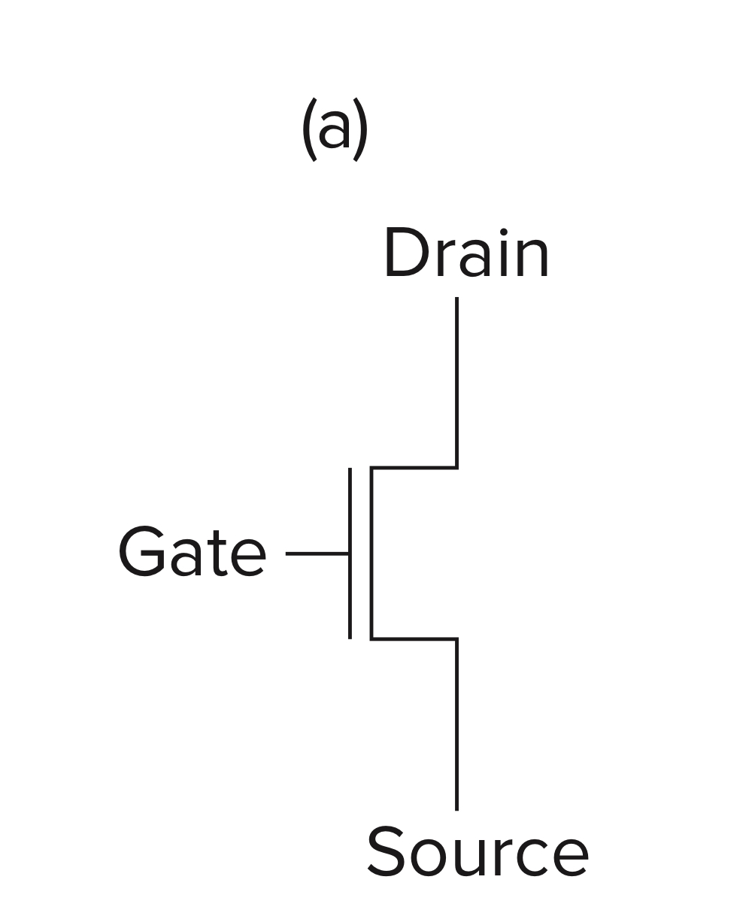

    - gate is supplied with 1.2 volts: short circuit

    - gate is supplied with 0 volts: open circuit

    - 
      only show the terminals of the power supply, because the power supply itself provides the completion of the completed circuit is well understood.横线是正极，下三角代表接地

  - P-type （positive）

    掺杂B原子，缺电子，称为P-type半导体

    - 

    -  0 volts: short circuit:

    - 1.2 volts: open circuit

  - NMOS是栅极高电平（|VG-S| > Vt, VG - Vs > -Vt）导通,低电平断开,可用来控制与地之间的导通。

  - PMOS是栅极低电平（|VG-S| > Vt, VG - Vs < -Vt）导通,高电平断开,可用来控制与电源之间的导通

- CMOS circuits(complementary metal-oxide semiconductor): circuits that contain both P-type and N-type transistors
  CMOS门电路静态功耗低，抗干扰能力强，开关速度高，工作稳定可靠，适用于逻辑电路设计，应用非常广泛。

### 3.2 Logic Gates

There are transistor circuits that implement each of these functions. The corresponding circuits are called AND, OR, and NOT gates.

#### The NOT Gate(Inverter)

- It is constructed from two MOS transistors, one P-type and one N-type.

- Q：为什么不能只使用PMOS？A：不管输入端为高电平还是低电平，VT1和VT2始终有一个处于截止状态，电源与地之间基本无电流通过，这样CMOS非门电路的功耗很低。

#### The NOR Gates


#### The OR Gates

- 
  [为什么PMOS在上，NMOS在下?](https://zhuanlan.zhihu.com/p/96545244)
####  The AND Gates

- 

#### Basic Logic Gates


### 3.3 Combinational Logic Gates

#### Decoder

A decoder has the property that exactly one of its outputs is 1 and all the rest are 0s.

- In general, decoders have n inputs and 2n outputs. We say the output line that detects the input pattern is asserted. 

- the input to the decoder is 10, resulting in the third output line being [asserted](https://zh.wikipedia.org/wiki/斷言_(程式)).!

- 

#### MUX (multiplexer)

a shows a logic gate implementation of a two-input multiplexer. 

- The function of a mux is to select one of the inputs (A or B) and connect it to the output. The select signal (S in Figure 3.12)determines which input is connected to the output.

- 

- 

- In general, a mux consists of 2^n^ inputs and n select lines.

#### A One-Bit Adder

- 
- 

#### The Programmable Logic Array(PLA)

- It consists of an array of AND gates (called an AND array) followed by an array of OR gates (called an OR array). The number of AND gates corresponds to the number of input combinations (rows) in the truth table. For n-input logic functions, we need a PLA with 2^n^ n-input AND gates.
- 

#### Logical Completeness

> the set of gates {AND, OR, and NOT} is logically complete because we can build a circuit to carry out the specification of any truth table we wish without using any other kind of gate.

- NAND实现其他几个gates的逻辑电路图

### 3.4 Basic Storage Elements

- The R-S Latch

- 

  

  - **Setting the latch**:  set the latch to store 1

  - **Resetting the latch**: set the latch to store 0

  - **The Quiescent State:  S and R are 1**
    
    > We describe the quiescent (or quiet) state of a latch as the state when the latch is storing a value, either 0 or 1, and nothing is trying to change that value. 
    
  - Setting the Latch to a1 or a0

    - a1: momentarily set S to 0, keep R 1

    - a0: momentarily set R to 0, keep S 1

    - then, set R and S both to 1 (return to the quiescent state)

  - **set**: setting a variable to 0 or 1, as in “set to 0” or“set to 1.”

  - **clear**: the act of setting a variable to 0.

  - Note: We should point out that if both S and R were allowed to be set to 0 at the same time, the outputs a and b would both be 1, and the final state of the latch would depend on the electrical properties of the transistors making up the gates and not on the logic being performed. 

- The Gated D Latch

- WE(write enable): 为1时可写入数据。

- 

### 3.5 The Concept of Memory

> Memory is made up of a (usually large) number of locations, each uniquely identifiable and each having the ability to store a value.

#### address

> unique identifier associated with each memory location 

#### addressability

> the number of bits of information stored in each location

- Most memories are byte-addressable.

#### Address Space

> the total number of uniquely identifiable locations

- With n bits of address, we can uniquely identify 2^n^ locations. 

  - kilo ~ 2^10^

  - mega ~ 2^20^

  - giga ~ 2^30^
- 注意和 address space 做区分，address space 指的是 memory 中，依据寻址输入（下图的`A[1:0]`）能够查询到的 location 数量的**==上限==**（即两条线但是只画出了 3 个location的话，address space 依然是 4）。

#### A 2^2-by-3-Bit Memory

- 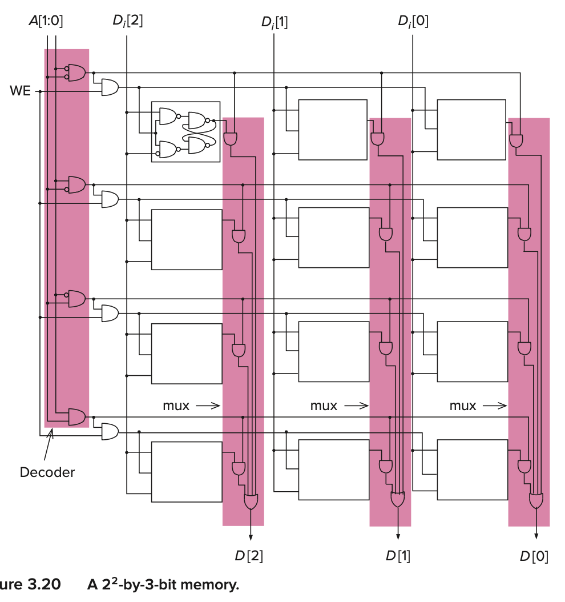


> In both cases, our notation A[high:low] and D[high:low] reflects the fact that we have numbered the bits of address and data from right to left, in order, starting with the rightmost bit, which is numbered 0.

### 3.6 Sequential Logic Circuits


> In this section, we discuss digital logic structures that can **both** ==process information== (i.e., make decisions) **and** ==store information==.
>
> Sequential logic circuits are used to implement a very important class of mechanisms called ***finite state machines***.
>
> They contain storage elements that allow them to keep track of prior history information.
>
> Note also that the output can be dependent on **both** the inputs now **and** the values stored in the storage elements. The values stored in the storage elements reflect the history of what has happened before.(输出结果和输入值、历史状态都有关)

#### 3.6.1 Combination Lock

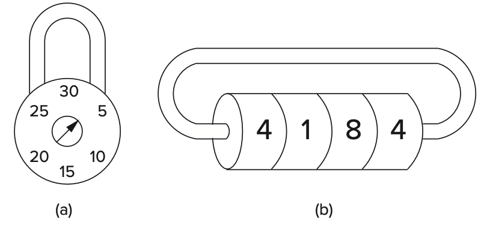

- combination lock

  > Whether or not this lock opens is totally independent of the past rotations of the four wheels. The lock does not care at all about past rotations. The only thing important is the current value of each of the four wheels.
  >
  > 是否解开组合锁和旋转圈数等状态无关，只和**当前**的值有关

- sequential lock

  > Because the lock stores the previous rotations and makes its decision (open or don’t open) on the basis of the the history of the past operations, that is, on the correct *sequence* being performed.

#### 3.6.2 The Concept of State

> The state of a mechanism— more generally, the state of a system—is a snapshot of that system in which all relevant items are explicitly expressed.
>
> That is: *The state of a system is a snapshot of all the relevant elements of the system at the moment the snapshot is taken.*

- examples：a combination lock, basketball games, tic-tac-toe

#### 3.6.3 The Finite State Machine(FSM) and its State Diagram

##### Elements

1. a finite number of states
2. a finite number of external inputs
3. a finite number of external outputs
4. an explicit specification of all state transitions
5. an explicit specification of what determines each external output value.

##### Combination Lock


> The explicit specifications of all state transitions are shown by the arrows in the state diagram. The more sophisticated term for “arrow” is *arc*. The arrowhead on each arc specifies which state the system is coming from and which state it is going to. 

- We refer to the state the system is coming from as the ***current state***, and the state it is going to as the *next state*.
- First, it is usually the case that from a current state there are **multiple transitions** to next states. The state transition that occurs depends on both the **current state** and the value of the **external input**.

#### 3.6.4 The Synchronous Final State Machine

> On the contrary, we say that computers are *synchronous* because the state transitions take place, one after the other, at identical fixed units of time.(以一个相同的、固定的时间单位进行状态转换) They are controlled by a *synchronous finite state machine*. 

同步和异步的区别：同步状态机和异步状态机是状态机的两种基本类型。异步状态机状态在输出信号经过一段时间延时后变化时，时间无法预测。同步状态机状态变化由时钟信号控制。

换句话说，异步状态机的状态切换的时间间隔是不确定的，由操作触发。

#### 3.6.5 The Clock

> A clock circuit produces a signal, commonly referred to as *THE clock*, whose value alternates between 0 volts and some specified fixed voltage.

##### Clock Cycle

> Each of the repeated sequence of identical intervals is referred to as a *clock cycle*. 
>
> A clock cycle starts when the clock signal transitions from 0 to 1 and ends the next time the clock signal transitions from 0 to 1. （计算机界约定俗成，一个时钟周期从一个上升沿开始到下一个上升沿结束）


#### 3.6.6 The Traffic Controller Example

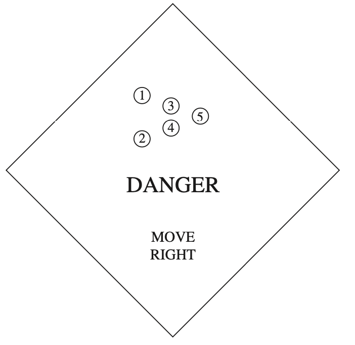


<center>State Diagram</center>

##### The Sequential Logic Circuit


###### Combinational Logic


- 有四种State，所以使用两个Storage Element

###### The Problem with Gated Latches

> The problem is the gated D latch. We want the output of OR gates Y and Z to transition to the next state at the end of the current clock cycle and allow the current state to remain unchanged until then. That is, we do not want the input to the storage elements to take effect until the end of the current clock cycle. Since the output of a gated D latch changes immediately in response to its input if the Write Enable signal is asserted, it cannot be the storage element for our synchronous finite state machine. 
>
> 在当前时钟周期内。存储单元的输出是逻辑电路的一个输入，逻辑电路会因此改变，但逻辑电路的输出又是存储单元的输入。该输入应该等到下一个时钟周期才能写入存储单元，如果使用D Gated Latch，那么就会一直改变。

###### Master-slave flip-flop （主从锁存器）


- Clock为 1，Master不可写，Slave可写，Master存储的数据写入Slave中，Slave写入逻辑电路中，整个电路进入下一个状态。
  Clock为 0，Master可写，Slave不可写，Slave保存的依旧是前一个状态，不会改变逻辑电路的状态。Master存入下一个状态的数据，为下一个状态做准备。
- Flip-flop实现了按照时钟周期读写，并且是用时钟控制WE。


- prop delay: 传播延迟

### 3.7 The Data Path of LC-3

> The data path consists of all the logic structures that combine to process information in the core of the computer.


#### Register

> It is a temporary location

> A register is simply a set of *n* flip-flops that collectively are used to store one *n*-bit value.
>
> In fact, a register can be any size that we need. 
>
> We usually need flip-flops, rather than latches, because it is usually important to be able to both read the contents of a register throughout a clock cycle and also store a new value in the register at the end of that same clock cycle.

- **PC, IR, MAR, and MDR** are all 16-bit registers that store 16 bits of information each
- The block labeled **REG FILE** consists of **eight registers** that each store **16 bits** of information. 
- The data path also shows three 1-bit registers, *N*, *Z*, and *P*.


- [x] 为什么register要用flip-flop，不能用latch。时序逻辑电路对register有什么要求？

> 在「组合电路」中，微小的信号传输迟延，都有可能造成输出毛刺。尽管毛刺是一个极其短暂的信号，但也可以引起逻辑电路的误动作。为了回避这个问题，就要使用时钟同步电路。如图所示，其构造是在FF（触发器）之间夹着「组合电路」。毛刺是「组合电路」在输出稳定之前，输出的短暂信号。因此，在「组合电路」输出稳定以后，再改变时钟，用触发器保持这个输出，就可以回避这种误动作了。
> 

- 所以尽管锁存器可能可以实现需求，但是因为信号传输延迟，使用寄存器（由FF组成）可以使电路更加稳定


## Chapter 4 The von Neumann Model

### 4.1 Basic Components

> The *instruction* is the smallest piece of work specified in a computer program. 
>
> The von Neumann model consists of five parts: *memory, a processing unit, input, output*, and *a control unit*. 
>
> The computer program is contained in the computer’s memory. 
> The data the program needs to carry out the work of the program is either contained in the program’s memory or is obtained from the input devices. 
> The results of the program’s execution are provided by the output devices.
> The order in which the instructions are carried out is performed by the control unit.
>
> 也可以被分为三部分，CPU(包含控制和操作单元)，MEMORY，I/O


#### Input and Output

> In order for a computer to process information, the information must get into the computer. 
>
> In order to use the results of that processing, those results must be displayed in some fashion outside the computer. 

#### Memory

- a typical memory in today’s world of computers consists of 2^34^（16GB） distinct memory locations, each of which is capable of storing eight bits of information. 

- To read the contents of a memory location, we first place the address of that location in the memory’s address register (**MAR**) and then interrogate the computer’s memory. The information stored in the location having that address will be placed in the memory’s data register (**MDR**). 
- To write (or store) a value in a memory location, we first write the address of the memory location in the MAR, and the value to be stored in the MDR. 
  We then interrogate the computer’s memory with the write enable signal asserted. 
  The information contained in the MDR will be written into the memory location whose address is in the MAR.

-  two characteristics of a memory location: its address and what is stored there.

#### Computation Unit / Processing Unit

> The actual processing of information in the computer is carried out by the *processing unit*.

- ALU
  The ALU normally processes data elements of a fixed size referred to as the *word length* of the computer. The data elements are called *words*.
  In the LC-3, the ALU processes 16-bit words. We say the LC-3 has a word length of 16 bits.
- Temporary locations
  Because the time it takes to access memory is long compared to the time it takes to perform the ADD or MULTIPLY. The most common form of temporary storage is a set of registers. The size of each register is identical to the size of values processed by the ALU; that is, they each contain one word.

#### Control Unit

> It is the control unit that keeps track of both where we are within the process of executing the program and where we are in the process of executing each instruction.

- IR (instruction register)
  To keep track of which instruction is being executed, the control unit has an *instruction register* to contain that instruction.
- PC (program counter)
  To keep track of which instruc- tion is to be processed next, the control unit has a register that contains the next instruction’s address.

### 4.2 The LC-3

- **Filled-in arrowheads**: data elements that flow along the corresponding paths.

- **Not-filled-in arrowheads**: control signals that control the processing of the data elements. 

- **MEMORY**

  1. storage elements

  2. **Memory Address Register (MAR)** 

     > for addressing individual locations.
     >
     >  Note that the MAR contains 16 bits, reflecting the fact that the memory address space of the LC-3 is ==2^16^== memory locations.

  3. **Memory Data Register (MDR)** 

     > for holding the contents of a memory location on its way to/from the storage.  
     >
     > The MDR contains 16 bits, reflecting the fact that each memory location contains 16 bits—that is, the LC-3 is ==16-bit addressable==.

- **INPUT/OUTPUT** 

  - a keyboard and a monitor. 

  - **a keyboard data register (KBDR)**

    > for holding the ASCII codes of keys struck

  - **a keyboard status register (KBSR)** 

    > for maintaining status information about the keys struck. 

  - **a display data register (DDR)** 

    > for holding the ASCII code of something to be displayed on the screen and 

  - **a display status register (DSR)**

    > for maintaining associated status information. 

- **THE PROCESSING UNIT** 
  - a functional unit (ALU) Algorithm and Logic Unit

  > perform arithmetic and logic operations. The LC-3 ALU can perform one arithmetic operation (addition) and two logical operations (bitwise AND and bitwise NOT).

  - eight registers (R0, ... R7)

  > for storing temporary values that will be needed in the near future as operands for subsequent instructions. 

- **THE CONTROL UNIT** 

  1. Its most important structure is the **finite state machine**, which directs all the activity. 

  2. Note the CLK input to the finite state machine in Figure 4.3. It specifies how long each clock cycle lasts. 

  3. The **instruction register (IR)** is also an input to the finite state machine since the LC-3 instruction being processed determines what activities must be carried out. 

  4. The **program counter (PC)** is also a part of the control unit; it keeps track of the next instruction to be executed after the current instruction finishes.

- [x] 为什么需要有限状态机？记录了什么状态？finite state machine记录了指令循环的状态（fetch（state1～3）-decode（state4）-evaluate address-get data-execute-store data

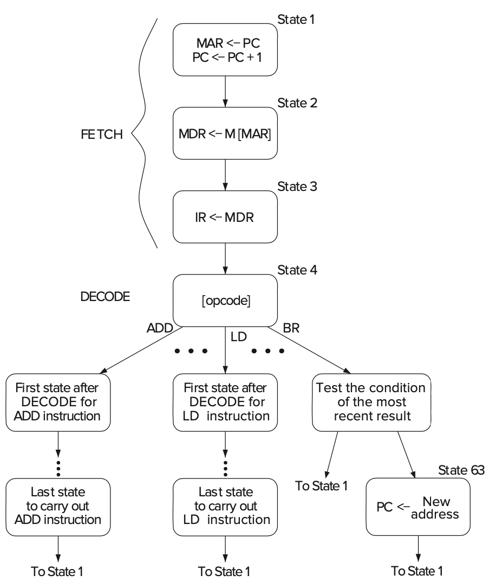


> State33 里的R指的是Ready，即内存是否读取完成

### 4.3 Instruction Processing

#### 4.3.1 The instruction

> The most basic unit of computer processing is the instruction.It is made up of two parts, the *opcode* (what the instruction does) and the *operands* (who it does it to!).
>
> There are fundamentally three kinds of instructions: *operates*, *data movement*, and *control*, although many ISAs have some special instructions that are necessary for those ISAs.

- **Operate** instructions operate on data. The LC-3 has three operate instructions: one arithmetic (ADD) and two logicals (AND and NOT). 
- **Data movement** instructions move information from the processing unit to and from memory and to and from input/output devices. The LC-3 has six data movement instructions.
- **Control** instructions are necessary for altering the sequential processing of instructions.

##### The ADD/AND Instruction

operands: two source operands and one destination operand

[15:12] opcode
[11:9] location for sorting the result
[8:6] one source operand
[5] determine whether to add / and an operand from register or immediately

立即数的范围是-16～15

##### The LD Instruction

> go to a particular memory location, read the value that is contained there, and store that value in one of the registers

operands: 2
addressing mode: PC+offset

[15:12] opcode
[11:9] the register to contain the value from the memory
[8:0] the offset

#### 4.3.2 The Instruction Cycle

> Instructions are processed under the direction of the control unit in a very systematic, step-by-step manner. 
>
> The entire sequence of steps needed to process an instruction is called the *instruction cycle*. 
>
> The instruction cycle consists of six sequential ***phases***, each phase requiring zero or more steps.

##### 4.3.2.1 Fetch

Step 1: Load the **MAR** with the contents of the **PC**, and simultaneously ==increment the PC==.(one clock cycle)
Step 2: Interrogate memory, resulting in the instruction being placed in the **MDR**. (one or many clock cycles depending on how long it takes to access the computer’s memory)
Step 3: Load the **IR** with the contents of the MDR.(one clock cycle)

##### 4.3.2.2 Decode

> The DECODE phase examines the instruction in order to figure out what the microarchitecture is being asked to do.

input: opcode IR[15:12]
output:corresponding to the opcode

##### 4.3.2.3 Evaluate Address

只有需要特殊寻址模式（PC+offset、Base+offset、间接寻址等）才需要这一阶段，从寄存器、从指令中读取操作数不需要计算地址

> the ADD and AND instructions in the LC-3 obtain their source operands from registers or from the instruction itself and store the result of the ADD or AND instruction in a register. For those instructions, the EVALUATE ADDRESS phase is not needed.

##### 4.3.2.4 Fetch Operands

LD，把计算的地址写入MAR，从内存中读数据到MDR中。
ADD，从寄存器中读数据。

- Note：In most current microprocessors, this phase (for the ADD instruction) can be done **at the same time** the instruction is being executed (the fifth phase of the instruction cycle)

##### 4.3.2.5 Execute

ADD，在ALU中执行加法

##### 4.3.2.6 Store Result

> In the case of the ADD instruction, in many computers this action is performed during the EXECUTE phase. That is, in many computers, including the LC-3, an ADD instruction can fetch its source operands, perform the ADD in the ALU, and store the result in the destination register all in a single clock cycle.

LD，把数据写入寄存器

##### 一些特例（不一定需要所有阶段）

> As already pointed out, the LC- 3 ADD instruction does not require a separate EVALUATE ADDRESS phase or a separate STORE RESULT phase. 
> The LC-3 LD instruction does not require an EXECUTE phase. On the other hand, there are instructions in other ISAs that require all six phases.

- [ ] 每个阶段到底都做了那些事情？（从内存中取数据放入MDR）
- [ ] 每个阶段需要多少个Clock Cycle？
- [ ] 每条指令都需要所有阶段吗？

#### 4.3.3 Change the Sequence of Execution

##### The BR Instruction

[15:12] opcode
[11:9] condition
[8:0] value added to incremented PC

寻址模式：PC+offset

#### 4.3.4 Control of the Instruction Cycle

> As is the case with the finite state machines studied in Section 3.6, each state corresponds to one machine cycle of activity that takes one clock cycle to perform. The processing controlled by each state is described within the node representing that state. The arcs show the next state transitions.

Fetch(3 CC)
Decode(1 CC)
继续按照时钟周期一步一步执行指令，直到结束，然后回到State1

#### 4.3.5 Halting the Computer(the Trap instruction)


A block diagram of the clock circuit, consisting primarily of a clock generator and a RUN latch

##### RUN latch

- Q = 1, output = 1. Q = 0, output = 0
- Stopping the instruction cycle requires only clearing the RUN latch.

> *Question:* If a HALT instruction can clear the RUN latch, thereby stopping the instruction cycle, what instruction is needed to set the RUN latch, thereby reinitiating the instruction cycle? *Hint:* This is a trick question!
>
> Answer: No! 因为在停止时钟周期后其他的指令都不再被执行，也就是说，即使你有一个恢复RUN latch的指令也不会被执行。

##### TRAP Instruction

- In some older machines, it is done by executing a HALT instruction. In the LC-3, as in many other machines, it is done under control of the operating system.
- if a user program requires help from the operating system, it requests that help with the TRAP instruction (opcode = 1111) and an eight-bit code called a *trap vector*, which identifies the help that the user program needs. The eight-bit code x25 tells the operating system that the program has finished executing and the computer can stop processing instructions.(用户通过TRAP指令向操作系统求助，依据trap vector来确定需要的帮助，可以实现如停止运行程序等操作)

## Chapter 5 The LC-3

### 5.1 The ISA Overview

> The ISA specifies all the information about the computer that the software has to be aware of. In other words, the ISA specifies everything in the computer that is available to a programmer when he/she writes programs in the com- puter’s own machine language.
>
> The ISA specifies the memory organization, register set, and instruction set, including the opcodes, data types, and addressing modes of the instructions in the instruction set.

#### 5.1.1 Memory Organization

- address space:2^16^		addressability:16bits		one word:16bits

- LC-3 is **word-addressable**

- 不是所有locations都用来存储数据

#### 5.1.2 Register

> The most common type of temporary storage locations, and the one used in the LC-3, is a set of registers. Each register in the set is called a ***general purpose register* (GPR).** 
>
> PC和IR是有特殊用途的寄存器，或者NZP这三个存Condition codes的一位寄存器
>
> The number of bits stored in each register is usually one word. In the LC-3, this means 16 bits.
>
> Registers must be uniquely identifiable. The LC-3 specifies eight GPRs, each identified by a three-bit register number. They are referred to as R0, R1, ... R7. Figure 5.1 shows a snapshot of the LC-3’s register set, sometimes called a *register file*, with the eight values 1, 3, 5, 7, −2, −4, −6, and −8 stored in R0, ... R7, respectively.
>
> 

#### 5.1.3 Instruction Set

> The instruction set is defined by its set of **opcodes, *data types*, and *addressing modes*.**
>
> The addressing modes determine where the operands are located. The data type is the representation of the operands in 0s and 1s.


#### 5.1.4 Opcodes

> The LC-3 ISA has 15 instructions, each identified by its unique opcode. The opcode is specified in bits [15:12] of the instruction. The opcode `1101` has been left unspecified, reserved for some future need.

[Three kinds discussed as before](#4.3.1 The instruction)(operate, data movement, control)

- Operate instructions: ADD, AND, NOT
- Data movement instructions: LD, LDI, LDR, LEA, ST, STR, STI
- Control instructions: BR, JSR/JSRR, JMP, RTI, TRAP

#### 5.1.5 Data Types

16位二进制补码

#### 5.1.6 Addressing Mode

> An addressing mode is a mechanism for specifying where the operand is located.
>
> An operand can generally be found in one of three places: in memory, in a register, or as a part of the instruction.

- **Literal / Immediate operand**: the operand is a part of the instrution
- 5 addressing modes (3 memory addressing modes)
  - non-memory addresses: immediate, register
  - memory addresses: PC-relative, indirect, base+offset

#### 5.1.7 Condition Codes(CC)

> The LC-3 has three single-bit registers that are individually set (set to 1) or cleared (set to 0) each time one of the eight general purpose registers is written into as a result of execution of one of the **operate instructions** or one of the **load instructions**.
>
> - Each operate instruction performs a computation and writes the result into a general purpose register. 
>
> - Each load instruction reads the contents of a memory location and writes the value found there into a general purpose register.

- 只有三种opcode(NOT AND ADD)和三种load指令会重设NZP的值。数据移动指令会根据数据内容重设，操作指令会根据计算结果重设NZP。
- Note：**LEA不改变NZP！**

- **Three single-bit registers N(negative), Z(zero), P(positive)**

> The set of three single-bit registers are referred to as *condition codes* because the condition of those bits are used to change the sequence of execution of the instructions in a computer program.
>
> 这些条件码在程序的运行中作为改变运行顺序的判断依据

### 5.2 Operate Instructions (NOT, AND, ADD)

##### NOT

> the only operate instruction that performs a *unary* operation


##### ADD / AND


#### Immediates Example


##### Applications


- Subtract: R3 = R1 - R2
  Take 2’s complement of R2, then add to R1.
  (1) R2 = NOT(R2)
  (2) R2 = R2 + 1
  (3) R3 = R1 + R2

- OR: R3 = R1 OR R2
 Use DeMorgan’s Law -- invert R1 and R2, AND, then invert result.
  (1) R1 = NOT(R1)
  (2) R2 = NOT(R2)
  (3) R3 = R1 AND R2
  (4) R3 = NOT(R3)

- Register-to-register copy: R3 = R2
R3 = R2 + 0 (Add-immediate)

- Initialize to zero: R1 = 0
R1 = R1 AND 0 (And-immediate)

#### The LEA instruction(Load Effective Address)

> It does not really operate on data, it simply loads a register with an address. It clearly does not move data from memory to a register, nor is it a control instruction. 
>
> Note that the value to be loaded into the register does **not** involve any access to memory. ...nor does it have any effect on the condition codes.（相当于直接把PC的内容复制到Register中）


- the LEA instruction is useful to initialize a register with an address that is very close to the address of the instruction doing the initializing.
- 把地址值写入到寄存器中，可以配合有base+offset寻址模式的指令使用
- LEA不改变Condition codes

### 5.3 Data Movement Instructions

>  The process of moving information from memory to a register is called a *load*, and the process of moving information from a register to memory is called a *store*.

- The LC-3 contains six instructions that move information: **LD, LDR, LDI, ST, STR, and STI.**


- require two operands, a source and a destination. 
  One of these locations is a **register,** the other is **a memory location or an input/output device.**（需要两个操作数，一个是寄存器，另一个是内存地址或IO设备）

- Bits [11:9] specify the register. 

  > If the instruction is a load, *DR* refers to the destination general purpose register that will contain the value after it is read from memory (at the completion of the instruction cycle). If the instruction is a store, *SR* refers to the register that contains the value that will be written to memory.

- Bits [8:0] contain the *address generation bits*

#### 5.3.1 PC-Relative Mode

- The memory address is computed by sign-extending bits [8:0] to 16 bits and adding the result to the incremented PC. 
- 限制：只能读写LD和ST指令附近（-255～256）（PC++）的地址

**LD and ST**

#### 5.3.2 Indirect Mode

> However, instead of this address being the **address of the operand** to be loaded or stored, it is **the address** of the address of the operand to be loaded or stored.

- 先通过PC-Relative获得目标地址（内存），再执行一次LD把目标内容存入寄存器。

**LDI and STI**

#### 5.3.3 Base+offset Mode

> The Base+offset mode is so named because the address of the operand is obtained by adding a sign-extended six-bit offset to a base register.

[5:0] 6 bits offset
[8:6] base register

- Note that the Base+offset addressing mode also allows the address of the operand to be anywhere in the computer’s memory. (可以访问任何位置)

**LDR and STR**

### 5.4 Control Instructions

> The LC-3 has five opcodes that enable the sequential execution flow to be broken: conditional branch, unconditional jump, subroutine call (sometimes called *function*), TRAP, and RTI (Return from Trap or Interrupt).

#### 5.4.1 Conditional Branches

##### BR(`opcode = 0000`)

- LC-3 has three condition code registers:	N -- negative	Z -- zero	P -- positive (greater than zero)

- Set by any instruction that writes a value to a register(ADD, AND, NOT, LD, LDR, LDI, LEA)

- Exactly one will be set at all times (Based on the last instruction that altered a register)

- If the set bit is specified, the branch is taken.
  PC-relative addressing:target address is made by adding signed offset (IR[8:0])to current PC.
  Note: PC has already been incremented by FETCH stage.
  Note: Target must be within 256 words of BR instruction.

- If the branch is not taken, the next sequential instruction is executed.
- 

##### JMP(`opcode = 1100`)

Target address is the contents of a register.
Allows any target address.

一般将`LEA`和`JMP`搭配使用，（因为可以通过ADD操作register）这样就可以到达任何一个地址（理论上）。单独看LEA+JMP和BR的操作范围其实没有区别，因为都是9bits的offset（在BR和LEA中确定），主要区别就是在灵活操作register（可以直接通过内存LD地址内容）。


##### TRAP(`opcode = 1111`)


| **vector** | **routine**                              |
| ---------- | ---------------------------------------- |
| **x23**    | **input  a character from the keyboard** |
| **x21**    | **output  a character to the monitor**   |
| **x25**    | **halt  the program**                    |

The TRAP instruction, often called *service call*, is useful because it allows a programmer to get help from the operating system to do things that the typical programmer does not fully understand how to do.

##### Two Method of Loop Control

- Counter
- Sentinel
  The end of a file is a "EOF"

### 5.6 The Data Path Revisited

#### 5.6.1 Basic Component

##### The Global Bus

> This triangle (called a *tristate device*) allows the computer’s control logic to enable ==exactly one== supplier to provide information to the bus at any one time. The structure wishing to obtain the value being supplied can do so by asserting its LD.x (load enable) signal (recall our discussion of gated latches in Section 3.4.2). (LD指令是允许从BUS写入该单元)


## Chapter 6 Programming


### Code for Conditional


### Code for Iteration


## Chapter 7 Assembly Language

### 7.1 Assembly Language Programming—Moving Up a Level

- 在一个高级语言程序被执行之前，会被翻译成多条ISA内的指令。

### 7.2 An Assembly Language Program

> The translation program is called an *assembler* (in this case the LC-3 assembler), and the translation process is called *assembly*.

#### 7.2.1 Instructions

**Instructions**

4 parts: `Label   Opcode   Operands   ; Comment` 
Two of the parts (Label and Comment) are optional.

##### 7.2.1.1 Opcodes and Operands

- mandatory

- operands can be obtained from registers , memory or literal values in the instruction.

- Register: explicitly represented

- memory: the symbolic name of the memory location is explicitly represented

- immediate operands: the actual value is explicitly represented

  > A literal value must contain a symbol identifying the representation base of the number.
  >
  > - `#` for decimal
  > - `x` for hexadecimal
  > - `b` for binary

##### 7.2.1.2 Label

> **Labels** are symbolic names that are used to identify memory locations that are referred to explicitly in the program. In LC-3 assembly language, a label consists of from 1 to 20 alphanumeric characters (i.e., each character is a capital or lower- case letter of the English alphabet, or a decimal digit), starting with a letter of the alphabet.
>
> other character strings that have specific meanings in an LC-3 program cannot be used as labels, like ADD, NOT, x1000, R4. Such not-allowed character strings are often referred to as *reserved words*.

- two reasons for explicitly referring to a memory location

1. The location is the target of a branch instruction.
2. The location contains a value that is loaded or stored.

- If a location in the program is not explicitly referenced, then there is no need to give it a label.

##### 7.2.1.3 Comments

- It is important to make comments that provide additional insight and do not just restate the obvious.
- 不要简单地描述一个指令，要给出这个指令的作用（在大局观下）

#### 7.2.2 Psudo-Ops(Assembler Directives)

> Rather, the pseudo-op is strictly a message from the assembly language program- mer to the assembler to help the assembler in the assembly process. Once the assembler handles the message, the pseudo-op is discarded.
>
> The LC-3 assembly language contains five pseudo-ops that we will find useful in our assembly language programming: `.ORIG`,` .FILL`,` .BLKW`,` .STRINGZ`, and` .END`. 

##### 7.2.2.1 `.ORIG`

> .ORIG tells the assembler where in memory to place the LC-3 program.

##### 7.2.2.2 `.FILL`

> .FILL tells the assembler to set aside the next location in the program and initialize it with the value of the operand. The value can be either a number or a label.

##### 7.2.2.3 `.BLKW`

> .BLKW tells the assembler to set aside some number of sequential memory locations (i.e., a **BL**oc**K** of **W**ords) in the program. The actual number is the operand of the .BLKW pseudo-op.

当要使用的数值还未知时来使用。

##### 7.2.2.4 `.STRINGZ`

> .STRINGZ tells the assembler to initialize a sequence of *n* + 1 memory locations. The argument is a sequence of *n* characters inside double quotation marks. 

- The final word of memory is initialized to 0. The last word, containing x0000, provides a convenient sentinel for processing the string of ASCII codes.

```assembly
	  .ORIG    x3010
HELLO .STRINGZ "Hello, World!"

```

##### 7.2.2.5 `.END`

> END tells the assembler it has reached the end of the program and need not even look at anything after it. That is, any characters that come after .END will not be processed by the assembler.

- It is simply a delimiter（定界符）—it marks the end of the program. It is a message from the programmer, telling the assembler where the assembly language program ends.

### 7.3 The Assembly Process

#### 7.3.2 A Two-Pass Process

在一对一的翻译中，汇编器很可能遇到Label，汇编器不知道这些抽象地址的含义，于是就需要一个symbol table。

> To prevent this from occurring, the assembly process is done in two complete passes (from beginning to .END) through the entire assembly language program. 

> The objective of the first pass is to identify the actual binary addresses corresponding to the symbolic names (or labels). This set of correspondences is known as the *symbol table*. 

- In pass 1, we construct the symbol table. 

- In pass 2, we translate the individual assembly language instructions into their corresponding machine language instructions.

#### 7.3.3 The First Pass: Creating the Symbol Table

> We keep track of the location assigned to each instruction by means of a location counter (LC). The LC is initialized to the address specified in .ORIG, that is, x3000.
>
> The assembler examines each instruction in sequence and increments the LC once for each assembly language instruction. If the instruction examined contains a label, a symbol table entry is made for that label, specifying the current contents of LC as its address.（LC记录着当前指令的地址，并且随着指令的移动increment，如果遇到Label，则把PC的值填入symbol table）


#### 7.3.4 The Second Pass: Generating the Machine Language Program

- 计算offset：目标地址 - incremented LC

  > *Note:* In order to use the LD instruction, it is necessary that the source of the load, in this case the address whose label is PTR, is not more than +256 or −255 memory locations from the LD instruction itself.

### 7.4 Beyond the Assembly of a Single Assembly Language Program

#### 7.4.1 The Executable Image

> When a computer begins execution of a program, the entity being executed is called an *executable image*.
>
> The executable image is created from modules often created independently by several different programmers. Each module is trans- lated separately into an object file.

#### 7.4.2 More than One Object File

> If the LC-3 assembly language had the pseudo-op .EXTERNAL, and if we had designated STARTofFILE as .EXTERNAL, the LC-3 assembler would be able to create a symbol table entry for STARTofFILE, and instead of assigning it an address, it would mark the symbol as belonging to another module.

编译时单独编译，在链接时处理下`.EXTERNAL`的地址问题

## Chapter 8 Data Structures

> A company’s organization chart and a list of items arranged in alphabetical order are two examples. We call these complex items of information *abstract data types*, or more colloquially *data structures*.

### 8.1 Subroutines(Functions)(Procedures)

- **libraries**: The collections of fragments that are used multiple times are available to user programmers to free them from having to write their own. 
- **Target**: To enable the programmer to write the code more efficiently

#### 8.1.1 The Call/Return Mechanism

> We refer to the program that contains the call as the *caller*, and the subroutine that contains the return as the *callee*.

- 这种机制有两个指令
  - JSR(R)：1. 往PC内装入subroutine的起始地址。(Loads PC, overwriting the incremented PC that was loaded during FETCH phase of the JSR(R) instruction.)2.往R7内装入JSR(R)下一条指令的地址(Store the incremented PC into R7.)
  
    > We call the address we come back to the *return linkage*. 
  
  - JMP R7：是subroutine的最后一个指令
    

##### 8.1.2 JSR(R)

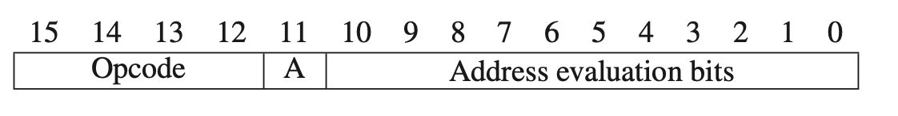

opcode: 0100	Bit[11]: addressing mode -- 1 PC-relative 0 Base+offset

- JSR和BR类似，只是有11位来计算偏移PC的地址，能到达更远的地址

- 

- JSRR和JMP类似，从一个基准寄存器中读取地址，能够实现任意地方的跳转

- 

#### 8.1.3 Saving and Restoring Registers

- **为什么要保存？**1.为了防止CALLER写入寄存器的数据被subroutine执行过程中新写入的数据覆盖，我们需要在subroutine的第一部分存储registers中的数据到memory中，对应到SaveR1，SaveR2，SaveR3。2.我们调用递归函数时寄存器绝对不能复用，调用前或调用时保存。

- **什么时候保存？**调取子进程前或调用时保存。在返回源程序前，返还这些数据回Reg。

> We call this technique *==callee save==* because the subroutine (i.e., the callee) saves and restores the registers.
>
> 这个操作需要subroutine来实现，因为subroutine知道它需要用到哪些REG。

但是对于R7来说，需要CALLER来存储，因为R7的内容会在执行JMP START时被毁坏。

> We call this *==caller save==* because the calling program saves and restores the register value.

- How to decide to use which save?

  > The one who knows the register will be "polluted" or overwritten **should save the values**.

#### 8.1.4 Library Routines

> They are legitimately advertised as *productivity enhancers* since they allow the application programmer to use them without having to know or learn much of their inner details.

### 8.2 The Stack

#### 8.2.1 An [Abstract Data Type](https://zh.wikipedia.org/zh-cn/%E6%8A%BD%E8%B1%A1%E8%B3%87%E6%96%99%E5%9E%8B%E5%88%A5)

> An abstract data type is a storage mechanism that is defined by the operations performed on it and not at all by the specific manner in which it is implemented.

> The concept of a stack is the specification of how it is to be *accessed*. 
>
> That is, the defining notion of a stack is that the **last** thing you stored in the stack is the **first** thing you remove from it.  
>
> Simply put: Last In, First Out, or **LIFO**.

> We say we ***push*** an element onto the stack when we insert it. We say we ***pop*** an element from the stack when we remove it.

> A distinguishing feature of the stack of Figure 8.8 is that, like the quarters in the coin holder, as each value is added or removed, **all the other values already on the stack move**.

Two Examples：the coin holder, the hardware datas

- One modle
- 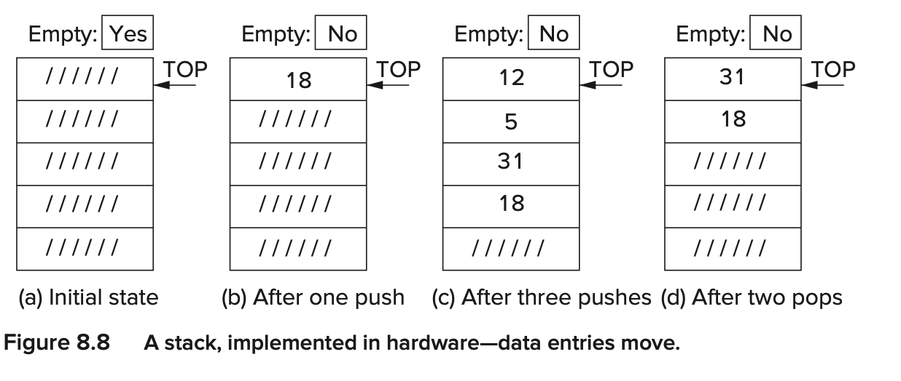
- each value is added or removed, **all the other values already on the stack move**.

#### Implementation in Memory

- This stack consists of a sequence of memory locations along with a mechanism, called the ***stack pointer***, which keeps track of the **top** of the stack. We use R6 to contain the address of the top of the stack. That is, in the LC-3, R6 is the stack pointer.


Note that the values inserted into the stack are stored in memory loca- tions having decreasing addresses. We say the stack *grows toward zero*. 

> when values are pushed and popped to and from a stack implemented in sequential memory locations, the data already stored on the stack **does not physically move**.(最后一张图中pop了头两个元素，但是数值仍然保存在内存中，虽然不能被访问if we obey the rules) 
>
> The fancy name for “the rules” is the *stack protocol*.

##### Push

**Push** We push a value onto the stack by executing the two-instruction sequence

``` assembly
PUSH ADD R6,R6,#-1
     STR R0,R6,#0 ; 先把数据存在R0中
```

>  That is, to push a value onto the stack, we first load that value into R0. Then we decrement R6, which contained the previous top of the stack. Then we execute STR R0,R6,#0, which stores the contents of R0 into the memory location whose address is in R6.

##### Pop

**Pop** To pop a value from the stack, the value is read and the stack pointer is incremented. The following two-instruction sequence

```assembly
POP         LDR   R0,R6,#0
            ADD   R6,R6,#1
```

##### Underflow

> Attempting to pop items that have not been previously pushed results in an *underflow* situation. 


用R5来存储underflow information。如果R5内的数据需要保护，要在JSR之前 caller save

The Pop Routine

```assembly
POP      AND     R5,R5,#0
         LD      R1,EMPTY
         ADD     R2,R6,R1
         BRz 	 Failure 
         LDR 	 R0,R6,#0 
         ADD 	 R6,R6,#1 
         RET
Failure  ADD 	 R5,R5,#1 
		 RET
EMPTY    .FILL   xC000 ; EMPTY <-- -x4000
```

##### Overflow

> Since we cannot store values where there is no space, we have an *overflow* situation.(没有足够的空间给数据存储)

```assembly
PUSH       AND     R5,R5,#0
           LD      R1,MAX
           ADD R2,R6,R1 BRz 
	       ADD R6,R6,#-1 
           STR R0,R6,#0 
           RET
Failure    ADD R5,R5,#1 RET
MAX        .FILL   xC005 ; MAX <-- -x3FFB
```

### 8.3 Recursion

> Recursion is a mechanism for expressing a function *in terms of itself*. 

“尾部递归”可以使用“迭代”来替换。 学过数据结构之后，对这个应该不陌生。

递归的优点在于易于理解；迭代的优点在于效率高。如何选择取决于你在“易于理解”和“效率”中如何作出权衡。

递归函数调用涉及一些运行时开销，包括参数必须压到堆栈中、为局部变量分配内存、寄存器的值必须保存等等，并且在每次调用返回时，上述保存操作必须还原，恢复成调用前的样子。迭代的实现方式开销显然要小。所以在可理解性相差不大的情况下，为了保证效率应该优先选择迭代。

#### 8.3.1 Bad Example Number 1: Factorial

> Every recursive subroutine must have such an initial test to see if we should execute the recursive call. 


不能正常实现！因为R7在嵌套调用的过程中会被不断覆盖！

> We can solve this problem by pushing the address A+1 onto a **stack** before executing JSR FACT at address B. After we subsequently return to address B+1, we can then pop the stack and load the address A+1 into R7 before we execute the instruction RET back to the main program.


还是不能实现，因为R1里暂存的n值也会不断被改写，其实本质上是SaveR1里面的值被不断改写。

> We can solve this problem with a stack also. That is, instead of moving the value n to R1 before loading n-1 into R0, we push n onto the stack and then pop it when we need it after returning from the subroutine with (n-1)! in R0.


是否可以节省一次压栈？Push n和Push R1不是重复了吗？

#### 8.1.2 Fibonacci(An Even Worse Example)


对于求阶乘和斐波那契数列来说，递归都比循环算法麻烦

#### 8.1.3 A Maze(Good example)


The words are stored in what we call *row major* order; that is, row 1 is stored, then row 2, then row 3, etc.


`BREADCRUMB` 是为了防止重复遍历某一个格子形成死循环

### 8.4 The Queue

> The defining property of the abstract data type *queue* is **FIFO**. FIFO stands for “First in First out.”
>
> We need to keep track of two ends of the storage structure: a FRONT pointer for servicing (i.e., removing elements from the front of the queue) and a REAR pointer for entering (i.e., inserting into the rear of the queue).
>
> We arbitrarily assign the FRONT pointer to the location **just before** the first element of the queue. (头指针指的是第一个元素之前的地址)
>
> We assign the REAR pointer to the location containing the most recent element that was added to the queue.

#### 8.4.1 The Basic Operations: Remove from Front, Insert at Rear


**Remove**

```assembly
ADD   R3,R3,#1
LDR   R0,R3,#0
```

**Insert**

```assembly
ADD   R4,R4,#1
STR   R0,R4,#0
```

#### 8.4.2 Wrap-Around

循环队列？

##### Remove


##### Load

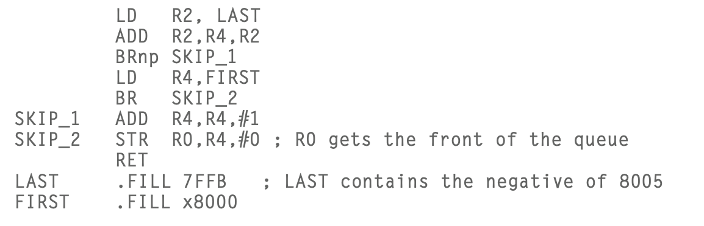

#### 8.4.3 How Many Elements Can We Store in a Queue?

> That is, if inserting an nth element into the queue would cause FRONT to equal REAR, we do not allow that insertion. We declare the queue full when there are n-1 elements in the queue.

如果存满n个数值，那么满队列和空队列的情形是一样的，即，FRONT和REAR指在同一个内存上，所以我们仅允许存n-1个元素在n个地址内。不允许出现REAR和FRONT相等的情形。


#### 8.4.4 Tests for Underflow, Overflow

> If the queue is empty and we try to remove an element, we have an *underflow* condition. 
>
> If the queue is full and we try to insert an element, we have an overflow condition.
>
> 我们依然用R5来存储是否成功，只要检测R3 是否等于 R4

- if FRONT = REAR, the queue is empty
- if FRONT = REAT + 1, the queue will overflow

### 8.5 Character Strings

A sequence of keyboard characters (letters, digits, and other symbols) is organized as a one-dimensional array of ASCII codes, usually representing a person’s name, address, or some other alphanumeric string. 

- A common use of a character string is to identify a body of information associated with a particular person. 
- **A Character String Representing an “Integer.”**需要判断是否每个字符都是一个decimal digit


```assembly
; Input: R0 contains the starting address of the character string ; Output: R5=0, success; R5=1, failure.
;
TEST_INTEGER ST R1,SaveR1 ; Save registers needed by subroutine ST R2,SaveR2
			 ST R3,SaveR3
			 ST R4,SaveR4
			 AND  R5,R5,#0   ; Initialize success code to R5=0, success
			 LD   R2,ASCII_0 ; R2=xFFD0, the negative of ASCII code x30
			 LD   R3,ASCII_9 ; R3=xFFC7, the negative of ASCII code x39
;
NEXT_CHAR	 LDR  R1,R0,#0 ; Load next char
			 BRz  SUCCESS	;这一步！！记得每次Load后要通过BRz判断是否读完。
			 ADD  R4,R1,R2
		 	 BRn  BAD
		 	 ADD  R4,R1,R3
		 	 BRp  BAD
			 ADD  R0,R0,#1
			 BR   NEXT_CHAR
;
BAD 		 ADD R5,R5,#1 
SUCCESS		 LD R4,SaveR4 
			 LD R3,SaveR3 
			 LD R2,SaveR2 
			 LD R1,SaveR1 
			 RET

ASCII_0			.FILL xFFD0
ASCII_9			.FILL xFFc7
SaveR1			.BLKW 1
SaveR2			.BLKW 1
SaveR3			.BLKW 1
SaveR4			.BLKW 1
```

#### Pointer

 Recall that R5, the base pointer, points to the first declared local variable, or object in this case.

```assembly
AND R0, R0, #0 ; Clear R0
ADD R0, R0, #4 ;R0=4
STR R0, R5, #0 ; object = 4
ADD R0, R5, #0  ; Generate memory address of object
STR R0, R5, #-1 ;Ptr = &object
```


## Chapter 9 I/O

### 9.1 Privilege, Priority, and the Memory Address Space

#### 9.1.1 Privilege and Priority

##### 9.1.1.1 Privilege

> Privilege is all about the right to do something, such as execute a particular instruction or access a particular memory location.

- 我们不想让任意程序都能执行HALT指令来停机，也不希望任意的程序都能干扰已有的数据结构或者代码。所以不是所有程序都能够有权利来执行所有的指令，也不是所有的程序都有权利访问所有的内存。
  Not all computer programs have the right to execute all instructions. 
  Similarly, some memory locations are only available to the operating system. 
- We designate every computer program as either privileged or unprivileged. We often say *supervisor privilege* to indicate privileged. 
- We say a program is executing in Supervisor mode to indicate privileged, or User mode to indicate unprivileged.
- **Access Control Violation (ACV) exception** An **ACV exception** occurs if a process attempts to access a location in privileged memory (either a location in system space or a device register having an address from xFE00 to xFFFF) while operating in User mode. 

##### 9.1.1.2 Priority

> Priority is all about the urgency of a program to execute. Every program is assigned a priority, specifying its urgency as compared to all other programs. This allows programs of greater urgency to interrupt programs of lesser urgency.

random program may be assigned a priority of 0. Keyboard may be assigned a priority of 4.

##### 9.1.1.3 Two Orthogonal Notions

##### 9.1.1.4 The Processor Status Register (PSR)

> The other register, the Processor Status Register (PSR), is shown in Figure 9.1. It contains the privilege and priority assigned to that program.

PSR[15] = 0 supervisor privilege
PSR[15] = 1 unprivilieged

PLR[10:8] priority level PL0[low]~PL7[high]


#### 9.1.2 Organization of Memory

##### System Space

> Locations ==x0000 to x2FFF== are privileged memory locations. They contain the various data structures and code of the operating system. They require supervisor privilege to access. They are referred to as *system space*.

##### User Space

> Locations ==x3000 to xFDFF== are unprivileged memory locations. Supervisor privilege is not required to access these memory locations. All user programs and data use this region of memory.

##### I/O page

> Addresses ==xFE00 to xFFFF== are used to identify registers that take part in input and output functions and some special registers associated with the processor.
>
> - PSR--xFFFC,
> - processor's Master Control Register(MCR)--xFFFE
>
>  Access to those registers requires **supervisor privilege**.


- two stacks(位置是怎么规定的？)
  - a *supervisor stack* in system space. It is controlled by the operating system and requires supervisor privilege to access.(x0000~x2FFF)
  - a *user stack* in user space. The user stack is controlled by the user program and does not require privilege to access.(x3000~xFDFF)

- Each has a stack pointer, Supervisor Stack Pointer (SSP) and User Stack Pointer (USP), to indicate the top of the stack. 
- Since a program can only execute in Supervisor mode or User mode at any one time, only one of the two stacks is active at any one time. 
- Register 6 is generally used as the stack pointer (SP) for the active stack. Two **registers**, Saved_SSP and Saved_USP, are provided to save the SP not in use. 

### 9.2 Input/Output

>  Even the simplest I/O devices usually need at least two registers: **one** to hold the data being transferred between the device and the computer, and **one** to indicate status information about the device. An example of status information is whether the device is available or is it still busy processing the most recent I/O task.

#### 9.2.1 Some Basic Characteristics of I/O

##### 9.2.1.1 Memory-Mapped I/O vs. Special I/O Instructions

- Some computers use special input and output instructions. 

  > The 12-bit PDP-8 instruction contained a three-bit opcode. If the opcode was 110, an I/O instruction was indicated. The remaining nine bits of the PDP-8 instruction identified which I/O device register and what operation was to be performed.

- Most computers prefer to use the same data movement instructions that are used to move data in and out of memory.

  > The original PDP-11 ISA had a 16-bit address space. All addresses wherein bits [15:13] = 111 were allocated to I/O device registers. That is, of the 216 addresses, only 57,344 corresponded to memory locations. The remaining 213 were memory-mapped I/O addresses.

- 因为使用相同的data movement指令，所以输入输出设备的寄存器也要像内存一样有独一无二的定位。因此，每个设备寄存器都会有一个来自内存的地址。

- That is, the I/O device registers are *mapped* to a set of addresses that are allocated to I/O device registers rather than to memory locations. Hence the name *memory-mapped I/O*.

##### 9.2.1.2 Asynchronous vs. Synchronous

- 人类打字的速度跟不上计算机的Clock Cycle。即使设置了固定的慢速，打字速度也会因为时间而变化。所以都是行不通的。也就是说，人类打字和电脑时asynchronous的。

- The point is that I/O devices usually operate at speeds very different from that of a microprocessor, and **not in lockstep**. We call this characteristic **asynchronous**.

- To control processing in an asynchronous world requires some protocol or *handshaking* mechanism.

  > - In the case of the keyboard, we will need a one-bit status register, called a *flag,* to indicate if someone has or has not typed a character. 
  > - In the case of the monitor, we will need a one-bit status register to indicate whether or not the most recent character sent to the monitor has been displayed, and so the monitor can be given another character to display.
  > - These flags are the simplest form of *synchronization*.

- A single flag, called the *ready bit*（输入时置1，电脑读取时置0）
- 但是如果人类的输入能固定在一个精确的间隔，比如200million个时钟周期，那么人和电脑就是同步的（synchronous）

##### 9.2.1.3 Interrupt-Driven vs. Polling

> - This is called *interrupt-driven I/O*, where the keyboard controls the interaction. 
> - Or, does the processor control the interaction, specifically by interrogating (usually, again and again) the ready bit until it (the processor) detects that the ready bit is set. At that point, the processor knows it is time to read the device register. 

> 中断驱动就是将CPU从繁忙等待的繁琐中解脱出来。在发送完一个或一批数据后，CPU就去忙别的事情。I/O设备处理完这批数据后，向CPU发出中断。CPU响应中断后再发送下一批数据。具体来说，中断驱动I/O的过程如下：
>
> 
>
> 1）CPU初始化I/O并启动第一次I/O操作。
> 2）CPU去忙别的事情。
> 3）当I/O完成时，CPU将被中断。
> 4）CPU处理中断。
> 5）CPU恢复被中断的程序。


#### 9.2.2 Input from the Keyboard

##### 9.2.2.1 Basic Input Registers (KBDR and KBSR)

- 处理输入需要两样东西：1.数据寄存器 2.一种同步化机制来使处理器知道有输入发生


- In the case of KBDR, bits [7:0] are used for the data, and bits [15:8] contain x00. In the case of KBSR, bit [15] contains the synchronization mechanism, that is, the ready bit.

##### 9.2.2.2 The Basic Input Service Routine

```assembly
START	LDI R1, A 
		BRzp START ; poll the ready bit
		LDI R0, B 
		BRnzp NEXT_TASK 
A		.FILL xFE00 ;the memory-mapped address of KBSR
B		.FILL xFE02 ; KBDR
```

##### 9.2.2.3 Implementation of Memory-Mapped Input


the EXECUTE phase

1. MAR is loaded with address of a device register
2. The address control logic selects the the corresponding device register to provide input to the MDR
3. The destination register is loaded with the contents of MDR

#### 9.2.3 Output to the Monitor

##### 9.2.3.1 Basic Output Registers (DDR and DSR)

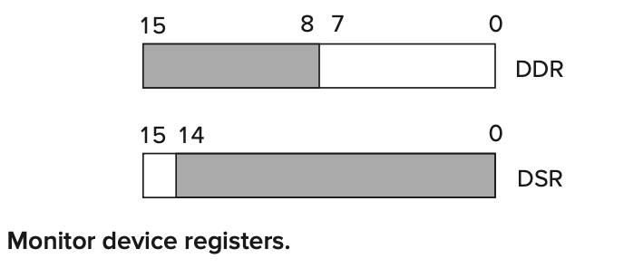

- In the case of DDR, bits [7:0] are used for data, and bits [15:8] contain x00. In the case of DSR, bit [15] contains the synchronization mechanism, that is, the ready bit. 

##### 9.2.3.2 The Basic Output Service Routine

```assembly
START	LDI R1, A
		BRzp START
		STI R0, B
		BRnzp NEXT_TASK
A		.FILL xFE04 ; DSR
B		.FILL xFE06 ; DDR
```

- Note the use of LDI and the indirect access to xFE04, the memory-mapped address of DSR.
- Note the use of the STI instruction, which stores R0 into xFE06, the memory-mapped address of DDR. 

##### 9.2.3.3 Implementation of Memory-Mapped Output

1. MAR is loaded with the address of a device register (through indirect addressing mode)
2. The address control logic asserts the load enable signal of DDR
3. DDR is written


##### 9.2.3.4 Example: Keyboard Echo

```assembly
START	LDI R1, KBSR 
		BRzp START ; poll the redit bit
		LDI R0, KBDR
ECHO	LDI R1, DSR
		BRzp ECHO
		STI R0, DDR
		BRnzp NEXT_TASK 
KBSR	.FILL xFE00
KBDR	.FILL xFE02
DSR		.FILL xFE04
DDR		.FILL xFE06
```

##### 9.2.4 A More Sophisticated Input Routine

```assembly
		LD R2, Newline
L1		LDI R3, DSR
		BRzp L1
		STI R2, DDR
		LEA R1, Prompt
LOOP	LDR R0, R1, #0
		BRz Input
L2		LDI R2, DSR
		BRzp L2
		STI R0, DDR
		ADD R1, R1, #1
		BRnzp LOOP
Input 	LDI R3, KBSR
		BRzp Input
		LDI R0, KBDR
L3		LDI R3, DSR
		BRzp L3
		STI R0, DDR
L4		LDI R3, DSR
		BRzp L4
		STI R2, DDR
DSR 	.FILL xFE04
DDR		.FILL xFE06
KBSR	.FILL xFE00
KBDR 	.FILL xFE02
Newline .FILL x000A
Prompt	.STRINGZ "Input a character >"
```

#### 9.2.5 Implementation of Memory-Mapped I/O, Revisited

> We have also learned that in order to support interrupt-driven I/O, the two status registers must be writeable as well as readable.

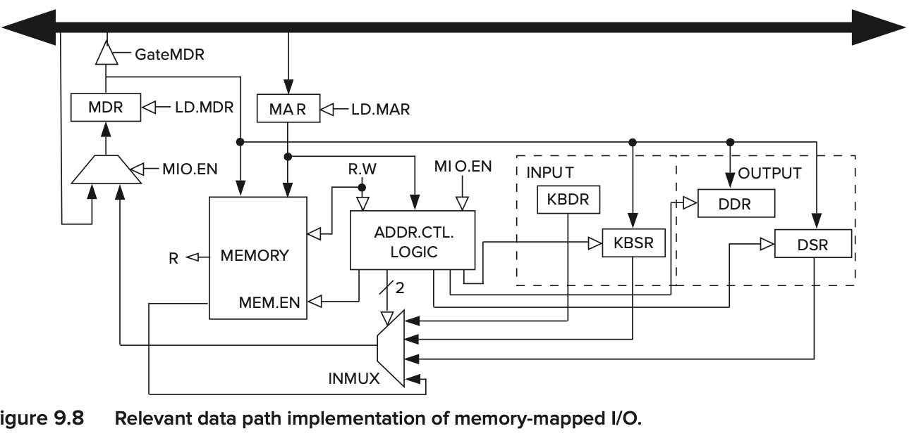

- The Address Control Logic Block controls the input or output operation.
- `MIO.EN` indicates whether a data movement from/to memory or I/O is to take place this clock cycle.
- `MAR` contains the address of the memory location or the memory-mapped address of an I/O device register.
- `R.W` indicates whether a load or a store is to take place.
- Depending on the values of these three inputs, the `address control logic` does nothing (MIO.EN = 0), or it provides the control signals to direct the transfer of data between the MDR and the memory or between the MDR and one of the I/O registers.
- If `R.W` indicates a load, the transfer is from memory or I/O device to the MDR. The Address Control Logic Block provides the select lines to INMUX to source the appropriate I/O device register or memory (depending on MAR) and also enables the memory if MAR contains the address of a memory location.
- If `R.W` indicates a store, the contents of the MDR is written either to memory or to one of the device registers. The address control logic either enables a write to memory or asserts the load enable line of the device register specified by the contents of the MAR.

### 9.3 Operating System Service Routines (LC-3 Trap Routines)

#### 9.3.1 Introduction

- The TRAP instruction 可以简化I/O的操作
- device registers不能被user programs改变，因为一不小心就会造成混乱，所以这一块内存仅有supervisor priority可以访问。

> We usually refer to the request made by the user program as a *system call* or a *service call*.

#### 9.3.2 The Trap Mechanism

The trap mechanism involves several elements:

- 1. A set of service routines 

  2. A table of the start addresses

     > This table is stored in memory locations x0000 to x00FF. 
     >
     > one Character output service routine (memory location x4020), stored in x0021
     >
     > one keyboard input service routine(x40A0),stored in x0023
     >
     > one machine halt service routine(x5020), stored in x0025
  
     
  
  3. The TRAP instruction
  
  4. A linkage back to the user program

#### 9.3.3 The TRAP Instruction

> (1) changing the PC to the starting address of the relevant service routine on the basis of its trap vector, and (2) providing a way to get back to the program that executed the TRAP instruction.

- The EXECUTE phase of the TRAP instruction

1. The PSR and PC are both pushed onto the system stack.(PC已经自加，会自动指向下一条指令)Note that the program requesting the trap service routine can be running either in Supervisor mode or in User mode. If in User mode, R6, the stack pointer, is pointing to the user stack. Before the PSR and PC can be pushed onto the system stack, the current contents of R6 must be stored in Saved_USP, and the contents of Saved SSP loaded into R6.
2. PSR[15] is set to 0. PSR[10:8] are left **unchanged** since ==the priority of the TRAP routine is the same as the priority of the program that requested it==.
3. The 8-bit trap vector is zero-extended to 16bits to form an address that corresponds to a location in the Trap Vector Table.(PC is loaded with that address)

（如果在USER Mode）先改变SP，再PSR入栈、PC入栈。更改权限。0拓展 Trap Vector，从其对应的Memory location中找到service routine的指令地址。

#### 9.3.4 The RTI Instruction: To Return Control to the Calling Program

- Return from TRAP of Interrupt(opcode = **1000**, with no operands): pop the top two values on the system stack into the PC and PSR. (用系统栈的前两个元素装载到PC和PSR里)
- 
- PC: Since the PC contains the address following the address of the TRAP instruction, control returns to the user program at the correct address.
- PSR: examine PSR[15], if in User mode, the stack pointers need to be adjusted to reflect that now back in User mode. loading the Saved_SSP with the current contents of R6, and loading the R6 with the contents of Saved_USP

#### 9.3.5 A Summary of the Trap Service Routine Process


#### 9.3.6 Trap Routines for Handling I/O

Two changes:

1. We add the appropriate .ORIG and .END pseudo-ops. .ORIG specifies the starting address of the input service routine—the address found at location x0023 in the Trap Vector Table.
2. We terminate the input service routine with the RTI instruction rather than the BR NEXT_TASK

#### 9.3.7 A Trap Routine for Halting the Computer

- In the LC-3, the RUN latch is bit [15] of the Master Control Register (MCR), which is memory-mapped to location xFFFE. (HALT就是负责把RUN latch置0的)

#### 9.3.8 The Trap Routine for Character Input (One Last Time)

#### 9.3.9 PUTS: Writing a Character String to the Monitor

> Thus, if a user program requires a character string to be written to the monitor, it need only provide (in R0) the starting address of the character string, and then invoke TRAP x22. In LC-3 assembly language this TRAP is called *PUTS*.

### 9.4 Interrupts and Interrupt- Driven I/O

I/O device can

1. force the running program to stop
2. have the processor execute a program that carries out the needs of the I/O device
3. have the stopped program resume execution as if nothing had happened.

#### 9.4.2 Why Have Interrupt-Driven I/O? 

> As is undoubtedly clear, polling requires the processor to waste a lot of time spinning its wheels, re-executing again and again the LDI and BR instructions until the ready bit is set.

一个例子：输入100个字符并处理需要花费的时间.（0.125s 输入一个字符。 12.49999s 处理100个字符）

- 轮询：$0.125*100 = 12.5$ $12.5 + 12.49999 = 24.9999$
- 中断驱动：$0.00001 * 100 + 12.49999 = 15$

#### 9.4.3 Two Parts to the Process

1. the mechanism that enables an I/O device to interrupt the processor 
2. the mechanism that handles the interrupt request.

#### 9.4.4 Part I: Causing the Interrupt to Occur

> Several things must be true for an I/O device to actually interrupt the program that is running:
>
> 1. The I/O device **must want** service.
> 2. The device **must have the right** to request the service.
> 3. The device request **must be more urgent** than what the processor is currently doing.

##### 9.4.4.1 The Interrupt Signal from the Device

- **The Device Must Want Service**I/O device wants service when the corresponding ready bit is set.（键盘会当一个字符敲击后want service，显示器会当上一个字符处理完后want service）

- **The Device Must Have the Right to Request That Service**

  > interrupt enable**(IE)** bit, which can be set or cleared by the processor (usually by the operating system), depending on whether or not the processor wants to give the I/O device the right to request service.
  >
  > is part of device status register

  - The **interrupt request signal from the I/O device** is the logical AND of the IE bit and the ready bit
  - 
  - 如果IE bit is clear，无论如何也无法interrupt处理器，只能等待轮询
  - 如果IE bit is set，只要ready bit被置1，那么AND gate就被断言，就会发出interrupt request

##### 9.4.4.2 The Urgency of the Request

> Recall from Section 9.1.1.2 that each program runs at a specified level of urgency called its priority level. To interrupt the running program, the device must have a higher priority than the program that is currently running. 
>
> 
>
> The PL of a program is usually the same as the PL (i.e., urgency) of the request to run that program.（如果一个更高优先级的请求被发出，那么正在运行的低级优先级程序就会中断，来把电脑留给处理高阶程序，直到满足这个更紧急的请求）

- a computer’s payroll program may run overnight, and at `PL0`
- A program that corrects for a nuclear plant current surge may run at `PL6`.
- Note: We can't interrupt an interrupt routine caused by a keyboard interrupt by pressing the key board again! Because they are at the same level!

##### 9.4.4.3 The INT Signal

> To stop the processor from continuing execution of its currently running program and service an interrupt request, the INT signal must be asserted.


- 不同的设备都会发出中断请求信号，这些信号都会被输入一个`priority encoder`里面，一个组合逻辑电路结构会选择最高的优先级。如果该请求的PL高于现在正在执行的程序，那么`INT`信号就被断言。

##### 9.4.4.4 The Test for INT

- 不在任意指令阶段(FETCH, DECODE, EVALUATE ADDRESS, FETCH OPERAND, EXECUTE, and STORE RESULT)被打断，而是只在最后一个指令循环阶段允许被打断。

- It makes much more sense to ignore interrupt signals except when we are at an instruction boundary; that is, the current instruction has completed, and the next instruction has not yet started.

- The additional logic to test for the interrupt signal is to augment the last state of the instruction cycle for each instruction with a test.

#### 9.4.5 Part II: Handling the Interrupt Request

> Three states
>
> 1. Initiate the interrupt (three lines numbered 1 in Figure9.17).
> 2. Service the interrupt (four lines numbered 2 in Figure9.17).
> 3. Return from the interrupt (one line numbered 3 in Figure9.17).
>
> 

##### 9.4.5.1 Initiate the Interrupt

The processor must do two things:

1. save the state of the interrupted program so it can pick up where it left off after the requirements of the interrupt have been completed
2. load the state of the higher priority interrupting program so it can start satisfying its request

- **Save the State of the Interrupted Program** in the case of the LC-3, saving the `PC` and the `PSR`

  - PC可以让被中断的程序恢复执行后，知道下一条指令是什么。
  - Condition codes可以使被中断的程序恢复执行后，正确执行条件跳转。
  - Priority Level会让被中断的程序恢复后知道哪些程序可以中断他。
  - Privilege Level描述什么样的processor resources可以被那个程序获取
  - 默认service routine会保存GPRs的内容

  > 具体操作和TRAP指令类似，如果在User mode，则保存USP，然后加载SSP到R6

- **Load the State of the Interrupt Service Routine** Most processors use the mechanism of *vectored interrupts*.

    > In the case of interrupts, the eight-bit vector is provided by the device that is requesting the processor be interrupted. That is, the I/O device transmits to the processor an eight-bit interrupt vector along with its interrupt request signal and its priority level.
  
    - 最高级别的interrupt request的interrupt vector被提供给了processor——INTV
    
    > If the interrupt is taken, the processor expands the 8-bit interrupt vector (INTV) to form a 16-bit address, which is an entry into the Interrupt Vector Table. 
    >
    > 位于==x0100 ~ x01FF==
  >
  > x0100 -- Privilege mode exception
  >
  > x0101 -- Illegal Opcode 
  >
  > x0101 -- Access Control Violation
  - PSR：PSR[2:0] contains no meaningful information. We arbitrarily load it initially with 010. Since the interrupt service routine runs in privileged mode, PSR[15] is set to 0. PSR[10:8] is set to the priority level associated with the interrupt request.

##### 9.4.5.2 Service the Interrupt

##### 9.4.5.3 Return from the Interrupt

- The last instruction in every interrupt service routine is RTI, return from trap or interrupt. 

#### 9.4.6 An Example

- 
- 

#### 9.4.7 Not Just I/O Devices

- a timer interrupt
- the machine check interrupt
- the power failure interrupt

### 9.5 Polling Revisited, Now That We Know About Interrupts

#### 9.5.1 The Problem

- 在Polling的过程中（将要执行STI），如果被I/O设备打断（如键盘此刻突然输入），那么就会改变显示器的状态，可能恢复被打断程序时显示器依然不能正常提供服务，因此此时再执行STI指令输出字符就会失效。
- A simple way to handle this would be to disable all interrupts while polling was going on. （但是polling会持续很长一段时间，这样对中断程序来说是不太可接受的）

#### 9.5.2 The Solution

- The result: An interrupt would have to wait for the three-instruction sequence LDI, BRzp, STI to execute, rather than for the entire polling process to complete.

```assembly
		.ORIG x0420
		ADD   R6,R6,#-1
        STR   R1,R6,#0
        ADD   R6,R6,#-1
        STR   R2,R6,#0
        ADD   R6,R6,#-1
        STR   R3,R6,#0
;	
        LDI   R1, PSR
        LD    R2,INTMASK
        AND   R2,R1,R2 
;        
POLL	STI   R1,PSR   ;enable interrupts
		STI   R2,PSR   ;disable interrupts
		LDI   R3,DSR
		BRzp  POLL ; Poll the DSR
		STI   R0, DDR; Store the character into the DDR 
		STI   R1, PSR; Restore original PSR
;
		LDR   R3,R6,0
		ADD   R6,R6,#1
		LDR   R2,R6,0
		ADD   R6,R6,#1
		LDR   R1,R6,0
		ADD   R6,R6,#1
		
		RTI
		
INTMASK .FILL xBFFF
PSR		.FILL xFFFF ;PSR is memory mapped to xFFFC.
DSR		.FILL xFE04
DDR		.FILL xFE06
		.END
```


## Chapter 10 A Calculator

> Our example is a program that simulates the actions of a calculator that a per- son can use to add, subtract, and multiply 2’s complement integers. The person will enter numbers into the calculator-simulator by typing keys on the keyboard.

- two points:
  - data conversion: ascii -> 2's complement -> ascii
  - arithmetic using a stack
- Our simulation of a calculator, like most calculators, does not use general purpose registers. Instead it uses a stack. Source operands are popped from the stack, and the result of the operation is pushed back onto the stack.

### 10.1 Data Type Conversion

- It is important that every instruction be provided with source operands of the data type that the instruction requires.(操作数据必须要符合指令的要求)
- For programming in some high-level language, the compiler generally does that conversion.F

#### 10.1.1 Example: A Bogus Program: 2 + 3 = e

- 不能直接把输入的数据相加，因为他们都是ascii码

#### 10.1.2 Input Data (ASCII to Binary)


- **R1** (the number of decimal digits)
- **ASCIIBUFF** is the address of the first memory location of a sequence of four memory locations that we have allocated (a) to store the ASCII codes of decimal digits entered from the keyboard, and (b) to store the ASCII codes corresponding to the result of arithmetic operations in preparation for writing it (the result) to the monitor.
- 可以把十位和百位的值都存成一张表，根据转换后的digit值查表，LD相应的数字。
- 

#### 10.1.3 Display Result (Binary to ASCII)

1. 检测是否为负数，若是负数则把负数flag标记，然后取补码转回正数
2. 循环-100，直到改数为负数，记录`循环次数-1`为百位数，把数+100抵消最后一次
3. 循环-10，同上
4. 直接存入个位

### 10.2 Arithmetic Using a Stack

#### 10.2.1 The Stack as Temporary Storage

- LC-3 将计算后的数据存在寄存器里，是一个**three-address machine**。x86是一个**two-address machine**，因为只需要确认两个位置。还有些ISAs不使用GPRs来存操作数和结果，最常见的是**stack machines**因为他们用栈来临时存储数据。
- Source operands are obtained by popping the top two elements from the stack. The result (i.e., the destination operand) is subsequently pushed onto the stack.
- No addresses need to be specified explicitly. Therefore, stack machines are referred to as **zero-address machines**.
- Note that the pop, push, and add are not part of the ISA of the computer, and therefore they are available to the programmer.

#### 10.2.2 An Example


#### 10.2.3 OpAdd, OpMult, and OpNeg

1. OpAdd, which will pop two values from the stack, add them, and push the result onto the stack.
2. OpMult, which will pop two values from the stack, multiply them, and push the result onto the stack.
3. OpNeg, which will pop the top value, form its 2’s complement negative value, and push the result onto the stack. This will allow us to subtract two numbers A minus B by first forming −B and then adding the result to A.

##### **The OpAdd Subroutine**

两种可能失败的情况

- Fewer than two values are available on the stack for source operands
- The result is out of range

- **TheADD**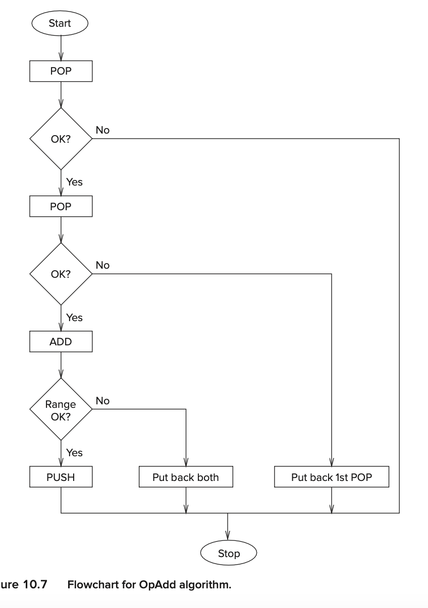

- 如果第一次pop失败了，那么什么也不用处理。如果第二次pop失败了，那么stack pointer会被decremented。如果结果有问题(调用RangeCheck子程序)，那么stack pointer会被decremented twice

```assembly
OpAdd			ST R0,OpAdd_Save0
                ST R1,OpAdd_Save1
                ST R5,OpAdd_Save5
                ST R7 OpAdd_Save7
                JSR POP ; Get first source operand.
                ADD R5,R5,#0 ; Test if POP was successful.
                BRp OpAdd_Exit ; Branch if not successful.
                ADD R1,R0,#0 ; Make room for second operand.
                JSR POP ; Get second source operand.
                ADD R5,R5,#0 ; Test if POP was successful.
                BRp OpAdd_Restore1 ; Not successful, put back first.
                ADD R0,R0,R1 ; THE Add.
                JSR RangeCheck ; Check size of result.
                ADD R5,R5,#0 ; Check R5 for success/failure.
                BRp OpAdd_Restore2 ; Out of range, restore both.
                JSR PUSH ; Push sum on the stack.
                BRnzp OpAdd_Exit
OpAdd_Restore2	ADD R6,R6,#-1
OpAdd_Restore1	ADD R6,R6,#-1
OpAdd_Exit		LD	R0,OpAdd_Save0
				LD	R1,OpAdd_Save1
				LD	R5,OpAdd_Save5
				LD	R7,OpAdd_Save7
				RET
OpAdd_Save0 	.BLKW #1
OpAdd_Save1 	.BLKW #1
OpAdd_Save5 	.BLKW #1
OpAdd_Save7		.BLKW #1		
```

- **The RangeCheck**

##### The OpMult Subroutine 


##### **The OpNeg Subroutine**

1. replace the top element on the stack with its negative 
2. use OpADD

### 10.3 The Calculator

#### 10.3.1 Functionality

- **X** Exit the simulation.
- **D** Display the value at the top of the stack.
- **C** Clear all values from the stack.
- \+ Pop the top two elements A,B off the stack and push A+B.
- ***** Pop the top two elements A,B off the stack and push A*B.
- − Pop the top element A off the stack and push “minus” A.
- **Enter** or **LF** Push the value typed on the keyboard onto the top of the stack.


## Chapter 19 Dynamic Data Structures in C

### 19.5 Linked Lists

> A *linked list* is a data structure that is similar to an array in that both can be used for data that is a sequential list of elements. 
>
> 
>
> The elements need not be adjacent in memory
>
>
> A linked list is a collection of elements, or *nodes*, where each node is one “unit” of data


