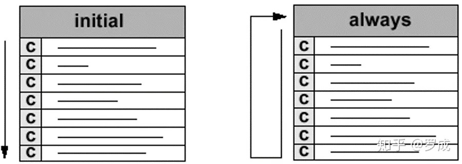

### 1 数据类型

wire reg

**wire** ：线网型数据类型，verilog语法中的一种主要数据类型，用于表示线网型信号，与实际电路中的信号连线相对应。wire是verilog中的默认数据类型，此例中的输入输出信号没有指定数据类型，则默认为wire型。除wire外，另外一种主要数据类型为reg，表示寄存器类型数据。

**reg** ：除wire类型外，另外一种常用的数据类型，一般表示寄存器类型数据，不过并不绝对，记住一条原则：在always块内被赋值的信号应定义成reg型，用assign语句赋值的信号应定义成wire型。

设计中，输入信号一般来说不能判断出上一级是寄存器输出还是组合逻辑输出，对于本级来说，就当成一根导线，即wire型。而输出信号则由自己来决定是reg还是组合逻辑输出，wire和reg型都可以。但一般的，整个设计的外部输出（即最顶层模块的输出），要求是reg输出，这比较稳定、扇出能力好。

但若此变量要放在begin...end之内，则该变量只能是reg型；在begin...end之外，则用wire型；使用wire型时，必须搭配assign；reg型可以不用。input、output、inout预设值都是wire型。

在Verilog中使用reg型，并不表示综合出来就是暂存器register：在组合电路中使用reg，组合后只是net；在时序电路中使用reg，合成后才是以Flip-Flop形式表示的register触发器。

reg型数据保持最后一次的赋值，而wire型数据需要持续的驱动。wire用在连续赋值语句assign中；reg用于always过程赋值语句中。

### 2 赋值

#### 2.1连续赋值

`assign`语句也称为连续赋值，并且始终处于活动状态。

用于对wire型变量赋值，符号用"assign"表示，格式如下，其中LHS（left hand side）指左侧，RHS（right hand side）指右侧

`assign     LHS_target = RHS_expression；`

LHS必须是一个标量，或者线性变量，不能是寄存器

RHS的类型没有要求，可以是标量或线型或存器向量，也可以是函数调用。

==阻塞赋值和非阻塞赋值都要发生在inital或always块中，在块外面的赋值只能为连续赋值assign==

#### 2.2过程赋值

##### 2.1.1阻塞赋值

阻塞赋值属于顺序执行，即下一条语句执行前，当前语句一定会执行完毕。

阻塞赋值语句使用等号 **=** 作为赋值符。

##### 2.1.2非阻塞赋值

非阻塞赋值属于并行执行语句，即下一条语句的执行和当前语句的执行是同时进行的，它不会阻塞位于同一个语句块中后面语句的执行。

非阻塞赋值语句使用小于等于号 **<=** 作为赋值符。

切记不要在一个过程结构中混合使用阻塞赋值与非阻塞赋值。两种赋值方式混用时，时序不容易控制，很容易得到意外的结果。

更多时候，在设计电路时，always 时序逻辑块中多用非阻塞赋值，always 组合逻辑块中多用阻塞赋值；在仿真电路时，initial 块中一般多用阻塞赋值。

```verilog
always @(posedge clk) begin
    a <= b ;
end
 
always @(posedge clk) begin
    b <= a;
end
```

#### 过程连续赋值

过程连续赋值属于过程赋值的一种，也是在initial和always语句块中使用assign - deassign、force - release的赋值语句。这样的赋值语句会改变所有在其他地方对wire或reg 的赋值，也就是不管你在其他任何地方改变了LHS的值，也会被直接改写。

### 3 时序控制

时延控制和事件控制。事件控制主要分为边沿触发事件控制与电平敏感事件控制。

#### 时延控制

基于时延的时序控制出现在表达式中，它指定了语句从开始执行到执行完毕之间的时间间隔。

时延可以是数字、标识符或者表达式。

根据在表达式中的位置差异，时延控制又可以分为常规时延与内嵌时延。

#### 边沿触发事件控制

在 Verilog 中，事件是指某一个 reg 或 wire 型变量发生了值的变化。

**一般事件控制**

事件控制用符号 **@** 表示。语句执行的条件是信号的值发生特定的变化。

关键字 posedge 指信号发生边沿正向跳变，negedge 指信号发生负向边沿跳变，未指明跳变方向时，则 2 种情况的边沿变化都会触发相关事件。

```verilog
//信号clk只要发生变化，就执行q<=d，双边沿D触发器模型
always @(clk) q <= d ;                
//在信号clk上升沿时刻，执行q<=d，正边沿D触发器模型
always @(posedge clk) q <= d ;  
//在信号clk下降沿时刻，执行q<=d，负边沿D触发器模型
always @(negedge clk) q <= d ;
//立刻计算d的值，并在clk上升沿时刻赋值给q，不推荐这种写法
q = @(posedge clk) d ;  
always @(posedge clk or negedge rstn)    begin      
//always @(posedge clk , negedge rstn)    begin      
//也可以使用逗号陈列多个事件触发
```

**敏感列表**

当组合逻辑输入变量很多时，那么编写敏感列表会很繁琐。此时，更为简洁的写法是 **@\*** 或 **@(\*)**，表示对语句块中的所有输入变量的变化都是敏感的. 即always模块中的任何一个输入信号或电平发生变化时，该语句下方的模块将被执行。

```verilog
always @(*) begin
//always @(a, b, c, d, e, f, g, h, i, j, k, l, m) begin
//两种写法等价
    assign s = a? b+c : d ? e+f : g ? h+i : j ? k+l : m ;
end
```

### 4 语句执行

#### 顺序块

顺序块用关键字 begin 和 end 来表示。

顺序块中的语句是一条条执行的。当然，非阻塞赋值除外。

顺序块中每条语句的时延总是与其前面语句执行的时间相关。

在本节之前的仿真中，initial 块中的阻塞赋值，都是顺序块的实例。

#### 并行块

并行块有关键字 fork 和 join 来表示。

并行块中的语句是并行执行的，即便是阻塞形式的赋值。

并行块中每条语句的时延都是与块语句开始执行的时间相关。

顺序块与并行块的区别显而易见，下面用仿真说明。

#### if

```verilog
if (condition1)       true_statement1 ;
else if (condition2)        true_statement2 ;
else if (condition3)        true_statement3 ;
else                      default_statement ;
```

if如果有多个语句，就要加begin和end

#### case

```verilog
case(case_expr)
    condition1     :             true_statement1 ;
    // ture_statement1 等执行语句可以是一条语句，也可以是多条。如果是多条执行语句，则需要用 begin 与 end 关键字进行说明。
    condition2     :             true_statement2 ;
    ……
    default        :             default_statement ;
endcase
```

casex、 casez 语句是 case 语句的变形，用来表示条件选项中的无关项。

casex 用 "x" 来表示无关值，casez 用问号 "?" 来表示无关值。

```verilog
casez(sel)
            4'b???1:     sout_t = p0 ;
            4'b??1?:     sout_t = p1 ;
            4'b?1??:     sout_t = p2 ;
            4'b1???:     sout_t = p3 ;  
        default:         sout_t = 2'b0 ;
    endcase
```

#### 循环

```verilog
while (condition) begin
    …
end

for(initial_assignment; condition ; step_assignment)  begin
    …
end

repeat (loop_times) begin
    …
end 
//repeat 的功能是执行固定次数的循环，它不能像 while 循环那样用一个逻辑表达式来确定循环是否继续执行。repeat 循环的次数必须是一个常量、变量或信号。如果循环次数是变量信号，则循环次数是开始执行 repeat 循环时变量信号的值。

forever begin
    …
end

//example forever 语句实现一个时钟边沿控制的寄存器间数据传输功能
reg    clk ;
reg    data_in, data_temp ;
initial begin
    forever @(posedge clk)      data_temp = data_in ;
end
```

**always** ：除assign外，另外一种实现赋值操作的关键字，两者都不可嵌套，区别在于，assign语句只能实现组合逻辑赋值，且一个assign语句后面只能跟一条赋值表达式。而always即能实现组合逻辑赋值，又能实现时序逻辑赋值操作，且可以包含多条赋值表达式，多条赋值表达式，则应位于begin/end对中间。

### 5 过程结构



过程结构语句有 2 种，initial 与 always 语句。它们是行为级建模的 2 种基本语句。一个模块中可以包含多个 initial 和 always 语句，但 2 种语句不能嵌套使用。这些语句在模块间并行执行，与其在模块的前后顺序没有关系。但是 initial 语句或 always 语句内部可以理解为是顺序执行的（非阻塞赋值除外）。每个 initial 语句或 always 语句都会产生一个独立的控制流，执行时间都是从 0 时刻开始。

initial 语句从 0 时刻开始执行，只执行一次，多个 initial 块之间是相互独立的。如果 initial 块内包含多个语句，需要使用关键字 begin 和 end 组成一个块语句。如果 initial 块内只要一条语句，关键字 begin 和 end 可使用也可不使用。

always 语句是重复执行的。always 语句块从 0 时刻开始执行其中的行为语句；当执行完最后一条语句后，便再次执行语句块中的第一条语句，如此循环反复。